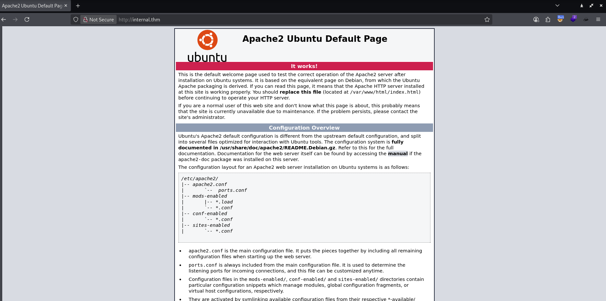

# TryHackMe - Lin Hard - Internal

📅 Дата: 2025-07-09  
🧠 Сложность: Hard  
💻 IP-адрес: 10.10.123.74  

---

## Sugar

```bash
nmap_ctf() {
  local ip=$1
  sudo nmap -sS -p- -Pn --max-parallelism 100 --min-rate 1000 -v -oN nmap-sS.txt $ip && nmap -sT -Pn -sV -T4 -A -v -p "$(grep -oP \"^[0-9]+(?=/tcp\s+open)\" nmap-sS.txt | sort -n | paste -sd \",\")" -oN nmap-sV.txt $ip
}
```


## 🔍 Сканирование

```bash
export ip=10.10.123.74 && nmap_ctf $ip
```

### nmap

```
PORT   STATE SERVICE VERSION
22/tcp open  ssh     OpenSSH 7.6p1 Ubuntu 4ubuntu0.3 (Ubuntu Linux; protocol 2.0)
| ssh-hostkey: 
|   2048 6e:fa:ef:be:f6:5f:98:b9:59:7b:f7:8e:b9:c5:62:1e (RSA)
|   256 ed:64:ed:33:e5:c9:30:58:ba:23:04:0d:14:eb:30:e9 (ECDSA)
|_  256 b0:7f:7f:7b:52:62:62:2a:60:d4:3d:36:fa:89:ee:ff (ED25519)
80/tcp open  http    Apache httpd 2.4.29 ((Ubuntu))
|_http-title: Apache2 Ubuntu Default Page: It works
| http-methods: 
|_  Supported Methods: OPTIONS HEAD GET POST
|_http-server-header: Apache/2.4.29 (Ubuntu)
Warning: OSScan results may be unreliable because we could not find at least 1 open and 1 closed port
Aggressive OS guesses: Linux 3.1 (95%), Linux 3.2 (95%), AXIS 210A or 211 Network Camera (Linux 2.6.17) (95%), ASUS RT-N56U WAP (Linux 3.4) (93%), Linux 3.16 (93%), Linux 2.6.32 (93%), Linux 3.1 - 3.2 (93%), Linux 3.11 (93%), Linux 3.2 - 4.9 (93%), Linux 3.7 - 3.10 (93%)
No exact OS matches for host (test conditions non-ideal).
Uptime guess: 30.812 days (since Mon Jun  9 02:19:09 2025)
Network Distance: 2 hops
TCP Sequence Prediction: Difficulty=244 (Good luck!)
IP ID Sequence Generation: All zeros
Service Info: OS: Linux; CPE: cpe:/o:linux:linux_kernel
```

Стартовая страница Apache


---

## 🕵️ Enumeration

### ffuf

Ищу директории
```
┌──(kali㉿0x2d-pentest)-[~/Labs/TryHackMe/Lin Hard - Internal/scans]
└─$ ffuf -fc 404 -t 100 -w /media/sf_Exchange/Dictionaries/Dir/directory-list-2.3-medium.txt -u http://internal.thm/FUZZ

blog                    [Status: 301, Size: 311, Words: 20, Lines: 10, Duration: 5699ms]
wordpress               [Status: 301, Size: 316, Words: 20, Lines: 10, Duration: 219ms]
javascript              [Status: 301, Size: 317, Words: 20, Lines: 10, Duration: 219ms]
phpmyadmin              [Status: 301, Size: 317, Words: 20, Lines: 10, Duration: 216ms]
```

Сайт использует wordpress, запускаю **wpscan**
```
┌──(kali㉿0x2d-pentest)-[~/Labs/TryHackMe/Lin Hard - Internal/scans]
└─$ wpscan --url http://internal.thm/wordpress/ -v
_______________________________________________________________
         __          _______   _____
         \ \        / /  __ \ / ____|
          \ \  /\  / /| |__) | (___   ___  __ _ _ __ ®
           \ \/  \/ / |  ___/ \___ \ / __|/ _` | '_ \
            \  /\  /  | |     ____) | (__| (_| | | | |
             \/  \/   |_|    |_____/ \___|\__,_|_| |_|

         WordPress Security Scanner by the WPScan Team
                         Version 3.8.27
       Sponsored by Automattic - https://automattic.com/
       @_WPScan_, @ethicalhack3r, @erwan_lr, @firefart
_______________________________________________________________

[+] URL: http://internal.thm/wordpress/ [10.10.123.74]
[+] Started: Wed Jul  9 21:56:13 2025

Interesting Finding(s):

[+] Headers
 | Interesting Entry: Server: Apache/2.4.29 (Ubuntu)
 | Found By: Headers (Passive Detection)
 | Confidence: 100%

[+] XML-RPC seems to be enabled: http://internal.thm/wordpress/xmlrpc.php
 | Found By: Direct Access (Aggressive Detection)
 | Confidence: 100%
 | References:
 |  - http://codex.wordpress.org/XML-RPC_Pingback_API
 |  - https://www.rapid7.com/db/modules/auxiliary/scanner/http/wordpress_ghost_scanner/
 |  - https://www.rapid7.com/db/modules/auxiliary/dos/http/wordpress_xmlrpc_dos/
 |  - https://www.rapid7.com/db/modules/auxiliary/scanner/http/wordpress_xmlrpc_login/
 |  - https://www.rapid7.com/db/modules/auxiliary/scanner/http/wordpress_pingback_access/

[+] WordPress readme found: http://internal.thm/wordpress/readme.html
 | Found By: Direct Access (Aggressive Detection)
 | Confidence: 100%

[+] The external WP-Cron seems to be enabled: http://internal.thm/wordpress/wp-cron.php
 | Found By: Direct Access (Aggressive Detection)
 | Confidence: 60%
 | References:
 |  - https://www.iplocation.net/defend-wordpress-from-ddos
 |  - https://github.com/wpscanteam/wpscan/issues/1299

[+] WordPress version 5.4.2 identified (Insecure, released on 2020-06-10).
 | Found By: Rss Generator (Passive Detection)
 |  - http://internal.thm/blog/index.php/feed/, <generator>https://wordpress.org/?v=5.4.2</generator>
 |  - http://internal.thm/blog/index.php/comments/feed/, <generator>https://wordpress.org/?v=5.4.2</generator>

[+] WordPress theme in use: twentyseventeen
 | Location: http://internal.thm/wordpress/wp-content/themes/twentyseventeen/
 | Last Updated: 2025-04-15T00:00:00.000Z
 | Readme: http://internal.thm/wordpress/wp-content/themes/twentyseventeen/readme.txt
 | [!] The version is out of date, the latest version is 3.9
 | Style URL: http://internal.thm/blog/wp-content/themes/twentyseventeen/style.css?ver=20190507
 | Style Name: Twenty Seventeen
 | Style URI: https://wordpress.org/themes/twentyseventeen/
 | Description: Twenty Seventeen brings your site to life with header video and immersive featured images. With a focus on business sites, it features multiple sections on the front page as well as widgets, navigation and social menus, a logo, and more. Personalize its asymmetrical grid with a custom color scheme and showcase your multimedia content with post formats. Our default theme for 2017 works great in many languages, for any abilities, and on any device.
 | Author: the WordPress team
 | Author URI: https://wordpress.org/
 | License: GNU General Public License v2 or later
 | License URI: http://www.gnu.org/licenses/gpl-2.0.html
 | Tags: one-column, two-columns, right-sidebar, flexible-header, accessibility-ready, custom-colors, custom-header, custom-menu, custom-logo, editor-style, featured-images, footer-widgets, post-formats, rtl-language-support, sticky-post, theme-options, threaded-comments, translation-ready
 | Text Domain: twentyseventeen
 |
 | Found By: Css Style In Homepage (Passive Detection)
 |
 | Version: 2.3 (80% confidence)
 | Found By: Style (Passive Detection)
 |  - http://internal.thm/blog/wp-content/themes/twentyseventeen/style.css?ver=20190507, Match: 'Version: 2.3'

[+] Enumerating All Plugins (via Passive Methods)

[i] No plugins Found.

[+] Enumerating Config Backups (via Passive and Aggressive Methods)
 Checking Config Backups - Time: 00:00:11 <====================================> (137 / 137) 100.00% Time: 00:00:11

[i] No Config Backups Found.

[!] No WPScan API Token given, as a result vulnerability data has not been output.
[!] You can get a free API token with 25 daily requests by registering at https://wpscan.com/register

[+] Finished: Wed Jul  9 21:56:40 2025
[+] Requests Done: 172
[+] Cached Requests: 5
[+] Data Sent: 38.875 KB
[+] Data Received: 359.73 KB
[+] Memory used: 279.887 MB
[+] Elapsed time: 00:00:27
```

[+] WordPress version 5.4.2 identified (Insecure, released on 2020-06-10).
[+] WordPress theme in use: twentyseventeen
sea


## 📂 Получение доступа


## ⚙️ Привилегии


## 🏁 Флаги

- User flag: 
- Root flag: 

---

## 📋 Резюме

🧰 **Инструменты:**
  - nmap, ffuf, и др.

🚨 **Уязвимости, которые удалось обнаружить:**  
  - Directory Traversal  
  - RCE через уязвимый скрипт  

🛡 **Советы по защите:**
  - Использовать сложные пароли и ограничить число попыток входа
  - Обновлять ПО до актуальных версий
  - Удалять/ограничивать использование SUID-бинарников
  - Настроить логирование и мониторинг системных событий
  - Применять принцип наименьших привилегий


